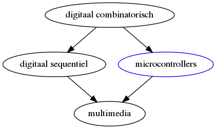

## Het vak "Microcontrollers"

* Wat houdt de cursus microcontrollers gegeven in ACE Groep T?
* Hoe past deze cursus binnen de opleiding?
* Wat ga je hier leren?

### Situering van de module binnen de opleiding

In de opleidingen 

* **digitale combinatorische**
* **digitale sequentiële**

heb je geleerd van - **hardwarematig** - logische devices te maken door te werken met: 

* Combinatorische logica te maken met logiche poorten
* Geheugen-elementen hier aan toe te voegen (flipflops, shift-registers, ...)
* Tellers
* ...

Om van deze hardware een werkbaar en flexibel product te maken wordt **hardware**  - zowel analoge als digitaal - in de praktijk gecombineerd met en aangestuurd door **microcontrollers** als besturings- en meet-element.

De kennis van deze **3 vakken** (binnen module digitale technieken) zal uiteindelijk worden **samengebracht** in het vak "multimedia" waar je deze vaardigheden zal combineren om multimedia-toepassingen te maken.

### Doelstelling van de cursus

In deze cursus leren we omgaan met deze **"kleine computers"** of **microcontrollers**:

* Hoe te **programmeren** (in C)?
* Hoe microcontrollers te **integreren** in electronische schakelingen?
* Optimaal de **hardware** van je **MCU** te gebruiken?
* Leren **datasheets** te **lezen** en werken met **registers**
* ...

We weken in deze cursus met AVR-microcontrollers, maar het uiteindelijke **doel/resultaat** van/na de cursus:

* Voldoende (minimale) **basiskennis** van C relevant voor het werken met MCU
* **Zelfstandig** met microcontrollers werken door datasheets te analyzeren
* En al doende een **nieuwe microcontroller**-architectuur te begrijpen
* **Basis-kennis/pakket** hebben van de belangrijkste en voornaamste 
      * **technieken** (registers, interrupts, timers, ...)
      * **peripherals** (gpio,pwm, adc, i2c, spi, ...) 

> Met andere woorden, na deze cursus wordt je in je eindwerk (en andere vakken) heel waarschijnlijk geconfronteerd met een microcontroller.  
> Met deze cursus willen je klaarstomen om dit op een zo zelfstandige basis te kunnen verwerken.

### Samenstelling cursus/Verschillende aspecten

* **Code:**  
Het aanleren van **programmeren** met een **focus** op de **C**-programmeertaal (Python komt in de laatste les ook aan bod).  
Dit wordt telkens ingeoefend aan de hand van korte labo-oefeningen op PC voor dat we dit toepassen op een microcontroller-omgeving.  

* **Architectuur en low-level**  
Het low-level en embedded programmeren steunt op een goede kennis van het platform.
Afhangende van het onderwerp zullen we dieper ingaan op instructie-sets, processsor-architectuur, opbouw van communicatie-protocols, ADC, ...  

* **Toepassing: tools en labo's**  
Het leren werken de benodigde tools zoals compilers, flash-tools, debuggers,  ...

* **Elektronica** en **integratie**
Herhaling vanuit de andere elektronica-vakken waar nodig (bijvoorbeeld pull-up en pull-down, PWM, ...)

* **Vrij Project**-werk  
Naast het labo-werk wordt er wat extra aanvullend materiaal ter beschikking gesteld om een gemeenschappelijk projectje te doen.  
... meer info volgt later

