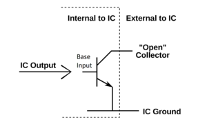
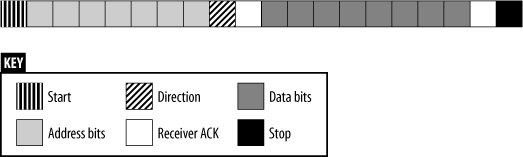

## I2C (Inter-Integrated Circuit)

I2C is (net zoals SPI) een serieel synchroon (werkt met clock) protocol, het is relatief goedkoop en is low-speed (100 kbps in standard mode, and 400 kbps in fast mode).  
I2C (beheerd door NXP) wordt ook wel officieus TWI genoemd (Two Wire Interface), het gebruikt slechts 2 draden om communicatie te voorzien tussen de master en slaves.

### Bidirectionaliteit

Deze 2 draden – SDA (seriele data) en SCL (seriele clock) – zijn bidirectioneel.  
Zowel de transmissie van de master naar slave als het antwoord van de slave(s) naar de master worden gedeeld over dezelfde (SDA) data-lijn (dit in tegenstelling tot SPI die voor beide richtingen een data-lijn nodig heeft).  
Deze bi-directionaliteit wordt mogelijk gemaakt door dat de pinnen (of drivers) van zowel de i2c-slave(s) als i2c-masters open-collector (of open-drain voor FET's) zijn.  

Beide draden (SDA en SCL) moeten verbonden aan een positieve spannings-bron via een pull-up-weerstand, hierdoor kunnen de pinnen (drivers) van de aangesloten IC's de spanning op deze lijn naar beneden trekken.

Deze open-collector-pins op de IC kunnen de spanning naar beneden trekken door (principe van open collector via een transistor  zoals de tekening hierboven) stroom te trekken via deze pull-up weerstand.  
Wanneer deze interne transistor echter gesloten wordt zal de spanning natuurlijk hoog blijven (tenzij een andere aangesloten IC deze naar beneden trekt.

### Transactie
Bij niet-activiteit (idle) blijven deze lijnen dus hoog, een master kan echter een “I2C-transactie” initieren door:
* De SDA-lijn naar beneden te trekken (laag)
* Gevolgd door SCL.

Dit signaleert alle ontvangers op de de bus dat een transmissie van een pakket zal starten.  
Wanneer dan SCL laag is zal de master over SDA de eerste bit overbrengen (laag of hoog). Dit wordt de "START conditie" genoemd.  
Elke bit die daarna wordt verzonden over de SDA-lijn wordt gesampled op de stijgende flank van de clock.  SDA mag dan enkel wijzigen bij de volgende stijgende flank.  
Deze transactie wordt beëindigd via een “stop-conditie”:  
* De SDA-lijn lost te laten (hoog)
* Gevolgd door SCL (hoog)

Door dit “aankondiging-systeem” kunnen er zich ook meerdere masters zich bevinden op deze “I2C-bus”, bij gelijktijdig gebruik zal de bus die de lijn hoog wil laten maar laag wordt getrokken zijn transactie stoppen en een error-conditie genereren.

### Bytes
I2C stuurt bytes door, de MSB wordt eerst doorgestuurd en de LSB laatst.  Elk van deze bytes moet worden bevestigd door de slave (ACK).  
Deze ACK – dit is eigenlijk de 9ste bit –  wordt bereikt door – na de 8 bits – een extra clock-puls te geven en de receiver controle te geven over de SDA-lijn.  
Als deze receiver de lijn laag trekt wordt dit dan gezien als een “acknowledgment” (of bevestiging van ontvangst), zoniet wordt de transactie afgebroken (error).  

#### Boodschap of pakket-transmissie:
De eerste byte van een i2c boodschap is een de adres-byte die bestaat uit:  
* 7 adres bits
* gevolgd door 1 richting bit.

**'0'** betekent dat de master naar de slave wil data versturen  
**'1'** betekent dat de master van de slave wil ontvangen  

Daarna volgt er een dataframe waarbij de ontvanger (slave bij '0' en master bij '1') elke byte zal bevestigen tot dat we aan de stop-conditie komen.

### Voorbeeld van een i2c-uitwisseling:
Veel moderne sensors stellen hun data ter beschikking via een digtale interface, in vele gevallen is dit i2c (als slave).  
Een typisch gebruik is om een MCU eerst een commando versturen - waar de adres-byte een richting bit '0' bevat - met als data-frame daaropvolgend commando-informatie naar de sensor toe (1 of meerdere bytes).
De sensor ondertussen start een meting en de MCU zal (afhangende van de duurtijd van de meting beschreven in de datasheet van de sensor) een lees-instructie versturen (richting-bit = '1').  
De sensor (slave) zal dan SDA overnemen en de meet-informatie schrijven (SCL blijft bij de master).  
Als de sensor echter niet klaar is zal er meestal de adres-byte niet bevestigd worden.  
Een alternatief op deze niet-bevestiging (als de sensor nog niet klaar is) is clock-stretching, dit houdt in dat de slave de clock naar beneden zal trekken tot dat deze klaar is.  
