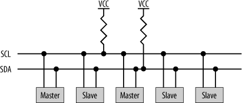
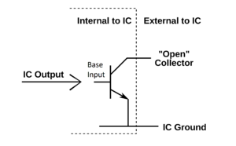
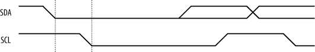
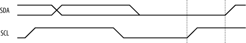
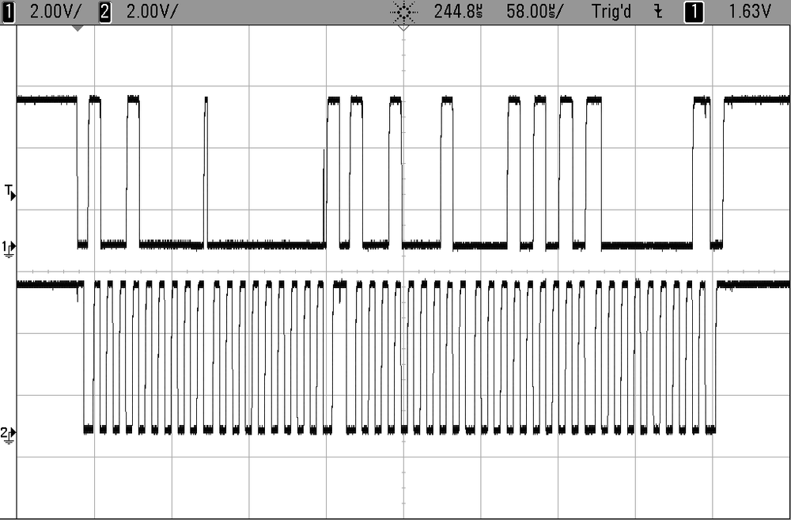
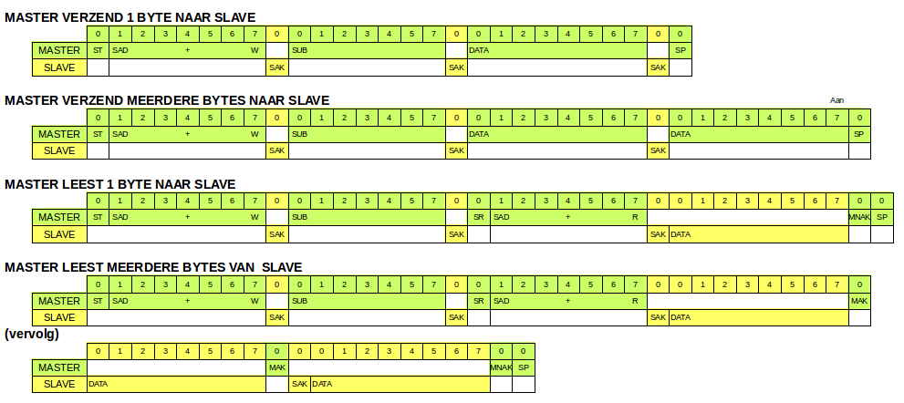
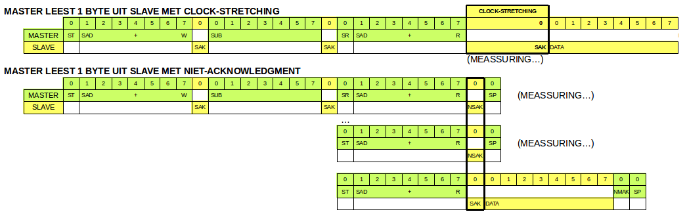
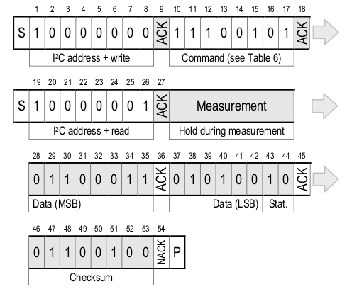
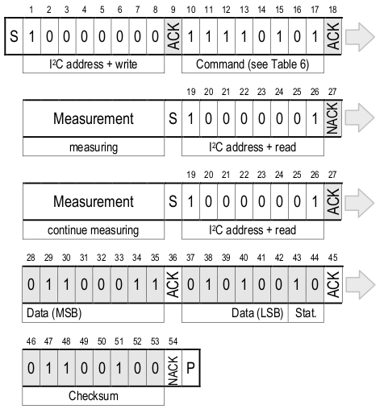

## I2C (Inter-Integrated Circuit)

I2C is (net zoals SPI) een serieel synchroon (werkt met clock) protocol, het is relatief goedkoop en is low-speed (100 kbps in standard mode, and 400 kbps in fast mode).  
I2C (beheerd door NXP) wordt ook wel officieus TWI genoemd (Two Wire Interface).

### Duiding: i2c is busprotocol

Samengevat, I2C is een **busprotocol**:

* Je kan 1 (of eventueel meerdere) MCU of besturings-apparaten aan sluiten.  
  Deze noemen we **master(s)**
* Je kan 1 of meerdere meerdere devices (sensors, led-schermen, ...) aansluiten.  
  Deze noemen we **slaves**  
* Een MCU of ander device kan eventueel zowel slave als master spelen.  
* Elke slave heeft een adres van 7 bits lengte (range 0-127), in uitgebreide versie kan dit 10 bit zijn
* Alle data- en (klok-)communicatie gebeurt **serieel** over **2 draden** (naast VCC en GND)

### Duiding: Bidirectionaliteit

Deze 2 draden – SDA (seriele data) en SCL (seriele clock) – zijn bidirectioneel.  
Zowel de transmissie van de master naar slave als het antwoord van de slave(s) naar de master worden gedeeld over dezelfde (SDA) data-lijn (dit in tegenstelling tot SPI die voor beide richtingen een data-lijn nodig heeft).  
Deze bi-directionaliteit wordt mogelijk gemaakt door dat de pinnen (of drivers) van zowel de i2c-slave(s) als i2c-masters open-collector (of open-drain voor FET's) zijn.  



Beide draden (SDA en SCL) moeten verbonden aan een positieve spannings-bron via een **pull-up-weerstand**, hierdoor kunnen de pinnen (drivers) van de aangesloten IC's de spanning op deze lijn naar beneden trekken (zie transactie).



Deze open-collector-pins op de IC kunnen de spanning naar beneden trekken door (principe van open collector via een transistor  zoals de tekening hierboven) stroom te trekken via deze pull-up weerstand.  
Wanneer deze interne transistor echter gesloten wordt zal de spanning natuurlijk hoog blijven (tenzij een andere aangesloten IC deze naar beneden trekt.

### Duiding: Transactie (of pakketten) in i2c

Bij niet-activiteit (idle) blijven deze lijnen dus hoog, een master kan echter een “I2C-transactie” initieren door:
 
* De SDA-lijn naar beneden te trekken (laag)
* Gevolgd door SCL.



Dit signaleert alle ontvangers op de de bus dat een transmissie van een pakket zal starten.  
Wanneer dan SCL laag is zal de master over SDA de eerste bit overbrengen (laag of hoog). Dit wordt de **start-conditie** genoemd.    

Elke bit die daarna wordt verzonden over de SDA-lijn wordt gesampled op de stijgende flank van de clock (SDA mag dan enkel wijzigen bij de volgende stijgende flank).   
Deze transactie wordt beëindigd via een **stop-conditie**:  

* De SDA-lijn lost te laten (hoog)
* Gevolgd door SCL (hoog)



Door dit **aankondiging-systeem** kunnen er zich ook meerdere masters zich bevinden op deze ```I2C```-bus, bij gelijktijdig gebruik zal de bus die de lijn hoog wil laten maar laag wordt getrokken zijn transactie stoppen en een error-conditie genereren.

Als je meer informatie wenst over het low-level gedeelte van i2c:

* http://i2c.info/i2c-bus-specification
* http://www.nxp.com/documents/user_manual/UM10204.pdf

### Duiding: Structuur van een bytes i2c

I2C stuurt bytes door:

* De MSB wordt eerst doorgestuurd 
* De LSB laatst.  
* Elk van deze bytes moet worden bevestigd door de slave (ACK).  

Deze **ACK** – dit is eigenlijk de 9ste bit –  wordt bereikt door – na de 8 bits – een extra clock-puls te geven en de receiver controle te geven over de SDA-lijn.  
 
Als deze receiver de lijn laag trekt wordt dit dan gezien als een **acknowledgment** (of bevestiging van ontvangst), zoniet wordt de transactie afgebroken (error).  

### Duiding: Adres-byte i2c

Een ```I2C```-boodschap (transcactie) bestaat uit meerdere bytes.  
De eerste byte van een ```I2C```-boodschap is een de adres-byte die bestaat uit:  

* 7 adres bits
* gevolgd door 1 richting bit:
    * **'0'** betekent dat de master naar de slave wil data versturen  
    * **'1'** betekent dat de master van de slave wil ontvangen  


Na deze eerste **adres-byte** volgt er een dataframe waarbij de ontvanger (slave bij '0' en master bij '1') elke byte zal bevestigen tot dat we aan de stop-conditie komen.

### Voorbeeld: Osciloscoop ter illustratie

Ter illustratie van deze byte zie je hieronder zo'n communicatie tussen master en slave op de osciloscoop:



* Voor elke byte te transfereren heb je 9 bit nodig
* Data wordt uitgelezen op de hoge klok
* Data wordt gewijzigd op de lage klok
* Je zien een aantal bredere lage klokken, deze komen voor bij de start van elke byte

### Duiding: Basis-commando's

Hieronder een overzicht van de meest relevante commando's gekend uit i2c (en die een MCU ter beschikking stelt)

**ST:**

* **St**art-conditie (zie eerder)
* Kondigt de start van een pakket aan

**SP:**

* Stop bit (zie eerder)
* Kondigt het einde van een pakket aan

**SR:**

* Herhaalde **s**tart (**r**epeated start)
* Idem aan ST maar wordt uitgevoerd direct na een transactie (zonder dat er een SP was)
* Kondigt een nieuw pakket aan 

**SAD + R:**

* **S**lave **Ad**ress **R**ead
* Samengesteld uit een adres van 7 bits gevolg door 1 (read)
* Volgt op ST of SR
* Kondigt aan dat de master data van een sensor wil lezen 

**SAD + W:**

* **S**lave **Ad**ress **W**rite
* Samengesteld uit een adres van 7 bits gevolg door 0 (read)
* Volgt op ST of SR
* Kondigt aan dat de master data van een sensor wil lezen 

**SUB:**

* *Sub**-adres
* Byte 
* Volgt op een SAD
* Wordt gebruikt 
     * als commmando voordat de read wordt geinitieerd (start meting bijvoorbeeld)
     * als register-adres bij de slave (een bepaalde waarde of configuratie)

**DATA:**

* Data die wordt getransfereerd
* Byte 
* Volgt op een SUB bij write of rechtstreeks na de een SAD+R bij een read
* Data-transfert 

**SAK:** 

* **S**lave **A**C**K** van client
* 1 bit met waarde 0
* Na een write van de master
* Bevestigd goede ontvangst van de sensor

**SNAK:**

* **S**lave **NA**C**K** van client
* 1 bit met waarde 1
* Na een write van de master
* Indiceert dat de slave niet klaar is om data te leveren  
 
**MAK:** 

* **M**aster **A**C**K** van master
* 1 bit met waarde 0
* Na het uitlezen van de slave
* Indiceert dat nog een byte moet gelezen worden

**NMAK:**

* **M**aster **NA**C**K** van master
* 1 bit met waarde 0
* Na het uitlezen van de slave
* Indiceert dat geen byte moet gelezen worden

### Duiding: Gebruik van i2c-commando's

Deze basis-commando's vallen (in de meeste gevallen) in de meeste gevallen terug in de volgende scenario's:



**Master verzendt (1 of meerdere bytes) naar slave: **

* Aankondigen van de zending (ST - SAD+w)
* De eerste data SUB is het type van data (of code van register)
* Dan volgt 1 of meerdere bytes, waarbij de slave geacht wordt een SAK te signaleren
* De transactie eindigt met een stop-conditie (SP)

**Master wil een (1 of meerdere bytes) van slave:**

* Gaat meestal vooraf met het aanvragen van data
* Dit gebeurt zoals een andere write maar dan met enkel een SUB
* Vervolgens wordt een SR gegenereerd door de master om de data uit te lezen
* Daarna genereert de slave een SAK
* De master zal elke byte bevestigen met een MAK
* Wanneer geen data meer nodig (of verwacht) is zal deze MNAK genereren en afsluiten met een SP

### Duiding: Clock-stretching (en alternatieven)

Een problematiek die voorkomt bij sensors of andere actuators is dat deze tijd nodig hebben om een meting uit te voeren (de ene wat meer als de andere).  
Dit houdt in dat het uitlezen van de bytes (na het uitsturen van meetcommando) niet direct kan worden geleverd.  

Om dit op te lossen zijn er 2 belangrijke strategien voorzien:

* **Clock-stretching:**  
  De slave zal na de instructie en tijdens het lezen de communicatie uitstellen/vertragen door de klok (SCL) naar beneden te "trekken".   
  Dit zorgt ervoor dat er geen data moet verstuurd worden (zolang klok laag is) en de device/sensor/actuator zijn meting kan uitvoeren.  
  (Nota: i2c voorziet geen time-outs maar dat is wel best te voorzien als je met i2c werkt)  
  (Nota: men noemt dit ook clock-synchronization)
* **Werken met non-ack van de slave uit:**  
  De slave zal dan na de SAD+R laten weten dat de data nog niet gereed is door een NSAK.  
  Het is de bedoeling dat je aan de kant van een MCU een timer gebruikt en eventueel retries voorziet ...
  (in de datasheet staat meestal gedocumenteerd hoe lang je moet lezen)



### Voorbeeld: lezen van sensor-waarde (met clock-stretching)

Een typisch gebruik van clock-streching is het uitlezen van een sensor.   
De sensor kan meestal - na het activeren van deze meting - niet direct antwoorden.  

Hieronder zie je 2 extracten uit de datasheet van de Sensirion SHT21 (een sensor die temperatuur en relatieve vochtigheid opmeet.  
Deze sensor supporteert beide mogelijkheden:

**Clock-streching:**  



**Werken met NACK vanuit slave:**  



### Duiding: TWI op de AVR

AVR geeft vanzelfsprekend support voor i2c, hoewel dat je deze naam niet zal terugvinden in de datasheet.  
De naam die AVR gebruikt is TWI, wat staat voor "two wire interface".  
Dit is zo omdat NXP (vroeger deel van Philips) licentie-kosten vereist voor het gebruik van de naam ```I2C```

### Duiding: TWI-registers op de AVR

**TWCR: (control register)**  
Controleert de werking van TWI:

* Inschakelen van TWI
* Start en stop
* ACK en NACK

**TWBR: (bit rate register)**  

* Bepaalt de bit-rate voor de master rate volgens de formule

```
F(scl) = F(cpu) / (16 + (2 * TWBR * prescaler))
```
In het hieropvolgend code voorbeeld komt dit neer op +-
```
F(scl) = 16Mhz / (16 + (2 * 32 * 1)) = ~229 Mhz 
```

**TWDR: (data register)**  

* Buffer voor verzonden of ontvangen data  
* 1 byte lang

**TWSR: (status register)**

* 5 MSB bevatten status
* 2 LSB kan je gebruiken voor de prescaler (ter aanvulling van bit-rate)

> **Nota:**    
> Omdat we niet de datasheet willen herhalen laten we het aan de student om de voorgaande principes en code te bekijken aan de hand van de datasheet (MCU en sensor)

### Voorbeeld: voorbeeld-code voor het lezen  

Hieronder hebben een voorbeeld van het gebruik van een sensor, namelijk de SDP600 van sensirion.  

Dit is een sensor die "differential pressure" (luchtverplaatsing) opmeet en zijn resultaat ter beschikking stelf via een ```I2C```-interface.


In dit geval is deze sensor geconnecteerd op een arduino mini pro van 8mHz gezien de sensor op 3.3 v werkt.  
Dit is het geval voor de meeste sensors dus bij een 5 v MCU is het aangeraden van een "logic convertor" te gebruiken die 5 v-signalen omzet naar 3.3 v en omgekeerd.

Het programma zal de data (buffer) en geconverteerde data daarna doorsturen.  


```{.c}
#include <util/delay.h>
#include <util/twi.h>
#include <avr/io.h>
#include <avr/interrupt.h>
#include "serieel.h"

#define SCL_PORT    PORTC   
#define SCL_BIT     PC5
#define SDA_PORT    PORTC
#define SDA_BIT     PC4

#define LOOP_TOT_BIT_SET(sfr, bit) do { } while (bit_is_clear(sfr, bit))

#define ADRESS_SDP600                                  0x40
#define COMMAND_FOR_DIFFERNTIAL_PRESSURE_WITH_HOLD     0xF1

int main(void) {
    serieel_initialiseer();
    _delay_ms(11);

    SCL_PORT |= 1 << SCL_BIT;   // pull up op TWI-clock-lijn
    SDA_PORT |= 1 << SDA_BIT;   // pull up on TWI-data-lijn
    TWBR = 32;                  // 8MHz / (16+2*TWBR*1) ~= 115kHz

    TWCR |= (1 << TWEN);        //activatie

    while (1) {

        //ST
        TWCR = ((1 << TWINT) | (1 << TWEN) | (1 << TWSTA));
        LOOP_TOT_BIT_SET(TWCR, TWINT);

        //SAD+W
        TWDR = (ADRESS_SDP600 << 1) + 0;
        TWCR = ((1 << TWINT) | (1 << TWEN));
        LOOP_TOT_BIT_SET(TWCR, TWINT);

        //SUB
        TWDR = COMMAND_FOR_DIFFERNTIAL_PRESSURE_WITH_HOLD;
        TWCR = ((1 << TWINT) | (1 << TWEN));
        LOOP_TOT_BIT_SET(TWCR, TWINT);

        //RT
        TWCR = ((1 << TWINT) | (1 << TWEN) | (1 << TWSTA));
        LOOP_TOT_BIT_SET(TWCR, TWINT);

        //SAD+R
        TWDR = (ADRESS_SDP600 << 1) + 1;
        TWCR = ((1 << TWINT) | (1 << TWEN));
        LOOP_TOT_BIT_SET(TWCR, TWINT);

        unsigned char buffer[3];

        //Leesmodus (met ACK)
        TWCR = ((1 << TWINT) | (1 << TWEN) | (1 << TWEA));
        LOOP_TOT_BIT_SET(TWCR, TWINT);
        buffer[0] = (TWDR);

        //Leesmodus (met ACK)
        TWCR = ((1 << TWINT) | (1 << TWEN) | (1 << TWEA));
        LOOP_TOT_BIT_SET(TWCR, TWINT);
        buffer[1] = (TWDR);

        //Leesmodus (met NACK)
        TWCR = (1 << TWINT) | (1 << TWEN);
        LOOP_TOT_BIT_SET(TWCR, TWINT);
        buffer[2] = (TWDR);

        //omvormen naar sensor-waarde
        int val;
        val = buffer[0];
        val <<= 8;
        val += buffer[1];
        val &= 0xFFFC;

        //versturen van de data
        serieel_verstuur_getal(buffer[0]);
        serieel_verstuur_string(" - ");
        serieel_verstuur_getal(buffer[1]);
        serieel_verstuur_string(" - ");
        serieel_verstuur_getal(buffer[2]);
        serieel_verstuur_string(" - ");
        serieel_verstuur_getal(val);
        serieel_verstuur_string("\n\r");
        _delay_ms(1000);
    }
    return 0;
}
```
