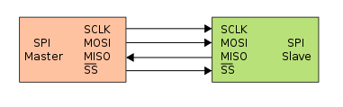
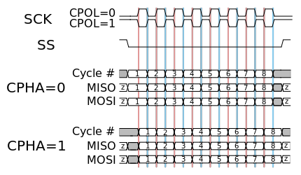
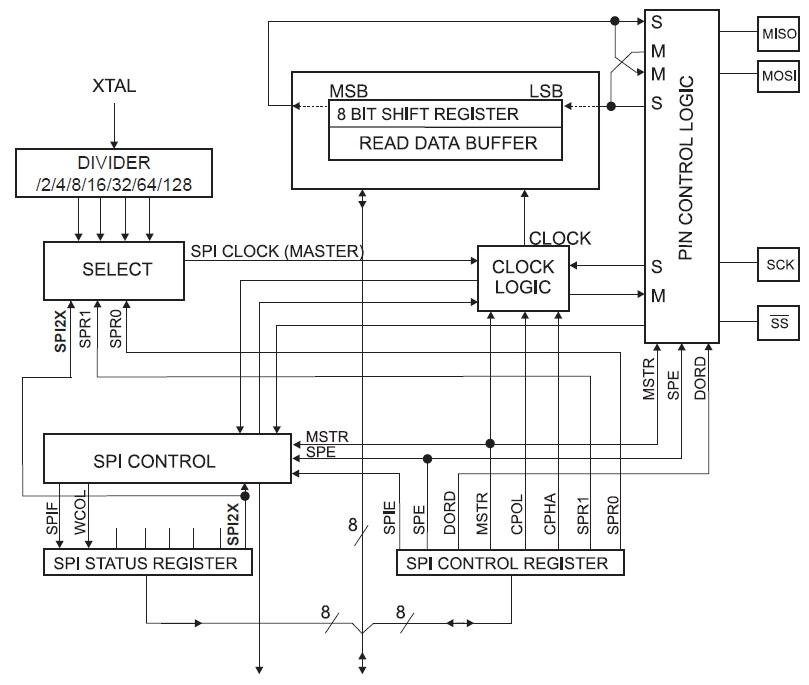

## Serial peripheral interface (SPI)

### Bustopologie

SPI maakt over het algemeen gebruik van 4 draden, hoewel 3-draads verbindingen ook een
mogelijkheid zijn (indien slave niets terug zend kan MISO weggelaten worden).
De 4 signaallijnen worden als volgt beschreven:

* SCLK:
Dit is de seriële klok die wordt gegenereerd door de master, dit is dus een output voor
master en input voor alle slaves.
* MOSI:
Master out slave in betekent dat het de data-uitgang is voor de master en de data-
ingang voor de slave.
* MISO:
Master in slave out betekent dat het de data-ingang is voor de master en de data-
uitgang voor de slave.
* SS :
Slave select, is een actief laag signaal waarmee de master de slaves selecteert
waarmee hij wil commmuniceren.

### Communicatie

SPI kan full duplex communiceren met een slave, dit betekent dat er gelijktijdig data kan verzonden en
ontvangen worden, dit in tegenstelling tot de eerder geziene I2C-bus die slechts half duplex kan zenden
en ontvangen (niet gelijktijdig).  
Indien er meerdere slaves aanwezig zijn op de bus, dan moeten deze hun MISO uitgang tristate kunnen brengen wanneer ze niet geselecteerd worden door de master, aangezien er anders geen communicatie mogelijk is met de overige slaves.  

De master bepaalt de klokfrequentie, maar bepaalt ook het niveau van de klok wanneer ze in rust is.
Dit wordt over het algemeen aangeduid met CPOL. CPOL = 0 betekent dat de klok in rust zich op het
laag niveau (0) bevindt. CPOL = 1 wil zeggen dat de klok in rust hoog is (zie Figuur hieronder).

Ook de klok-fase moet vastgelegd worden in CPHA, daarmee bepaalt men wanneer data wordt
ingelezen en wanneer data wordt gewijzigd.

Indien CPHA = 0 en CPOL = 0 wordt de data gesampled op de rising en gewijzigd op de falling edge.  
Indien CPHA = 0 en CPOL = 1 wordt de data gesampled op de falling en gewijzigd op de rising edge.  
Indien CPHA = 1 en CPOL = 0 wordt de data gewijzigd op de rising en gesampled op de falling edge.  
Indien CPHA = 1 en CPOL = 1 wordt de data gewijzigd op de falling en gesampled op de rising edge.  

### SPI op de ATMEGA

Net zoals voor de tellers, TWI, Uart enzovoort, beschikt de Atmega ook over een hardwarematige SPI-eenheid.  
Het blokdiagram hiervan is geillustreerd op de onderstaande figuur:

De slave select uitgang zal niet door de SPI-logica worden aangestuurd wanneer deze als master staat ingesteld. De bedoeling van een slave select is immers "om een slave te selecteren" dit kan men moeilijk in hardware implementeren omdat men niet kan voorzien hoeveel slaves er zullen zijn (per slave moet er een fysieke lijn gemaakt worden), en men weet ook niet welke slave(s) jij zal willen adresseren met een bepaald bericht.  
Indien daarentegen de SPI controller als slave staat ingesteld, hoeft deze enkel zijn eigen CS (chip
select) lijn te controleren, waardoor dit wel door de hardware kan gelezen worden.

Daarom moeten we deze uitgang softwarematig naar het logische 0 niveau brengen
vooraleer we data gaan verzenden over MOSI. Daarna schrijven we de te versturen data in het shift register, de SPI logica zal deze data nu voor ons verzenden op de ingestelde kloktransities (CPOL en CPHA). Wanneer de inhoud van het shift register versuurd is (1 byte) zal de "end of transmission flag" geset worden, waarna de volgende dat kan verstuurd worden.  
Indien ook de SPI interrupt enable bit is geset, zal er eveneens een interrrupt
gegenereerd worden.
