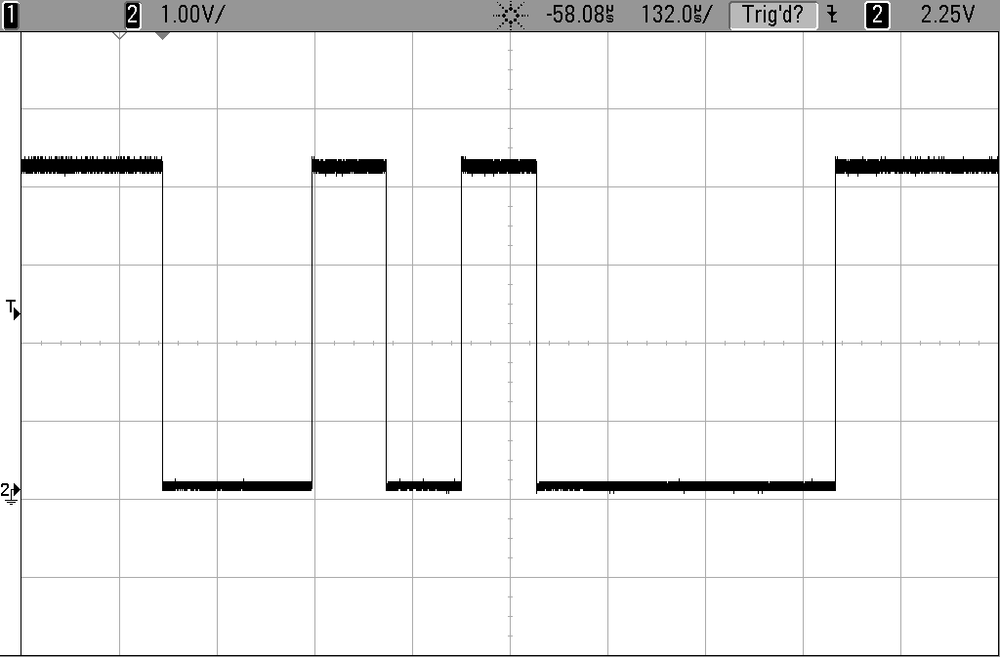
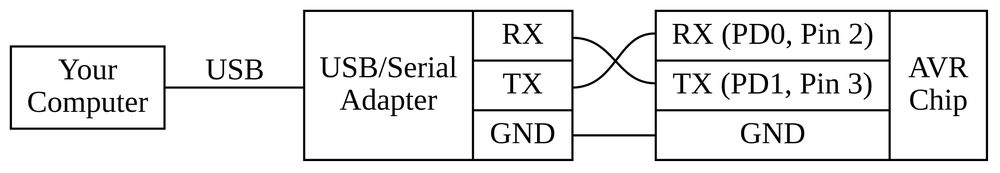

## Seriele communicatie (deel 1 => UART)

In de cursus hebben we tot nog toe gewerkt met GPIO (general purpose input output).  
Voor deze poorten kan je **parallel** een serie pinnen **individueel** een **lage** (0 V) of een **hoge** spanning (5 V) aanleggen.

### Seriele communicatie

Communicatie tussen verschillende (digitale) devices (computers, mcu, tablets, ...) gebeurt dikwijls over seriele protocollen.  

Een serieel protocol voor gegevensoverdracht stuurt alle bits informatie één voor één door, in tegenstelling tot een parallel protocol waar je verschillende waardes (bits) tegegelijk doorstuurt (zoals je bij een GPIO-poort meerdere pinnen in parallel kan manipuleren).

Hoewel parallele protocollen ook een aantal specifieke voordelen hebben zijn seriele protocollen vandaag niet weg te denken in datacommunicatie.  

Doordat je veelal minder lijnen moet gebruiken tov parallele lijnen en niet deze verschillende lijnen moet synchroniseren is het gebruik van seriele verbindingen éénvoudiger (en dikwijls met een hogere netto kloksnelheid)

Bij de bekendste seriele protocollen horen USB, RS-232, Ethernet, ADSL, ...

### UART

De éénvoudigste (en oudste) manier van seriele communicatie is **UART**, dit staat voor **"universal asynchronous receive and transmit"**.  
UART een component (meestal in hardware of software) die:

* parallele data omzet naar seriele data
* deze op 1 lijn (1 voor RX en 1 voor TX)
* tegen een bepaalde snelheid of baudrate (of bits per seconde)

> Soms vind je dit ok terug onder de naam Asynchronous Communication Interface Adapters (ACIAs)

### Principe

Onderstaande tekening geeft een (principieel) voorbeeld van hoe **2** digitale **devices** met elkaar **communiceren** over UART.  

In onderstaand voorbeeld gebruiken we 2 MCU'S maar dit kunnen ook computers, modems, raspberry pi's of eender welk device zijn (aan beide kanten).

```
---------------------------------                    ----------------------------------
|   |                    | UART |                    | UART |                     |   |
|   |                    --------                    --------                     |   |
|   | <-- parallel in -- |      |                    |      | <-- parallel out -- |   |
|   | <-- ontvangen ---- |  RX  | <---- serieel  --- |  TX  | --- verstuurd ----> |   |
| M | --- clock ------>  |      |                    |      | <-- clock --------- | M |
| C |                    --------                    --------                     | C |
| U | - parallel out ->  |      |                    |      | --- parallel in --> | U |
|   | <-- verstuurd ---- |  TX  | ----- serieel ---> |  RX  | --- ontvangen ----> |   |
|   | --- clock ------>  |      |                    |      | <-- clock --------- |   |
|   |                    --------                    --------                     |   |
---------------------------------                    ----------------------------------
```

Beide devices hebben elk een UART-component dat **2 seriele lijnen** beheerd: **RX** en **TX**.  
Aan elk van deze 2 lijnen is een buffer verbonden, deze buffer dient als interface om data te ontvangen en te versturen.  

De UART zet dus data die aan de in "parallel out" wordt geplaatst om naar een sequentiele stroom van bits op de TX-lijn.  
De snelheid waartegen bits op deze lijn worden gezet noemen we de baudrate.  
Als de transmissie gedaan is zal UART een signaal geven via de "verstuurd"-poort.

Daartegenover is ook een "parallel in"-buffer waar de UART data zal plaatsen wanneer data wordt ontvangen (en het "ontvangen"-signaal geven).  
De UART-module weet dat deze lijn moet worden gesampled als een start-bit wordt gedetecteerd (logische 0).  
Dit samplen gebeurt ook aan de afgesproken baudrate.

#### Afspraken

Bij een zuivere UART hebben beide devices hebben geen gemeenschappelijke klok, er is geen mechanisme om andere zaken af te spreken (aantal bits in een tranmissie, pariteits-bit, ....).

Bij beide devices moeten de UART's dan op dezelfde manier worden geconfigureerd.

### RS-232, RS-485, ...

UART definieert enkel het protocol op logische niveau (rx/tx, baudrate, start en stop-bits), maw UART is verantwoordelijk voor het omzetten van parallele data naar seriele data tegen een bepaalde baudrate.  

UART specifieert echter niet:

* **elektrische** specificaties (wat is een logische 0 of 1, spanning, common ground, ...)
* **flow control**, hoe weten we dat de andere kant gereed is om te lezen
* ...

Zoals het woord "UNIVERSAL" indiceert is dit een gemeenschappelijke standaard die wordt herbruikt in andere protocollen zoals RS-232, RS-422 en RS484 ...
Deze bouwen voor op UART maar definieren spanning-niveaus, connectors, extra signalen, flow-control, ... zodat je deze concreet kan inbouwen.

In de cursus beperken we ons tot het gebruik van UART (TTL 5V) om te communiceren tussen 2 Arduinos of om via de ftdi-chip die standaard op je Arduino is geintalleerd met je computer te praten.  

> Als je echter geinteresseerd mocht zijn om een RS-232, mag je altijd dit artikel bekijken https://www.arduino.cc/en/Tutorial/ArduinoSoftwareRS232


### UART en USART

Men spreekt ook soms van **USART**, hetgeen staat voor **"universal synchronuous and asynchronous receive and transmit"**

In het kader van de cursus praten we enkel over de asynchrone versie.


### Transmissie

UART is een **asynchroon** protocol, dit houdt in dat er geen gemeenschappelijke klok gebruikt om met UART tussen 2 devices te communiceren.  

In plaats hiervan wordt er een **baudrate** afgesproken, dit is het aantal bits per seconde dat wordt verstuurd.

> (er bestaan ook nog U**S**ART maar dat laten we buiten beschouwing)
De baudrate is de snelheid die wordt afgesproken tussen

De transmissie heeft de volgende eigenschappen:

* **Actief laag**:  
  **RX/TX** staat **hoog** wanneer niet actief (actief laag)
* **Start-bit**:  
  De **transmissie** van een byte wordt aangekondigd/gestart door een **start-bit**  
  Deze heeft de waarde **0**
* **Transmissie data**:  
  De bits worden gemoduleerd met amplitude data (1 is hoog 0 is laag)  
* **LSB eerst**:  
  de **"least (minst) significante" bit(s)** worden eerst doorgestuurd
* **Stop-bit**:  
  transmissie byte wordt beeindigd/bevestigd door dat de lijn terug in zijn default
  state gaat, dit noemt men de **stop-bit**

#### Error-detectie

De volgende soorten error komen typisch voor (en worden gedetecterdà bij UARTs:

* **Frame-error:**  
  De UART detecteert dat een stop-bit niet 1 is
* **Data-overrun:**  
  De interne data-buffer (parallele data) wort niet snel genoeg uitgelezen  
  (terwijl er nog data binnenkomt)
* **Parity-error:**  
  UART geeft de mogelijkheid een extra bit op te nemen.  
  Als deze bit niet overeen komt met de pariteit van de data zal de UART dit signaleren

#### Even en oneven pariteit

Pariteit van data natrekken is zeer eenvoudig:

* Men telt het aantal 1-bits
* Bij even pariteit is de partiteits-bit
  * 1 als het aantal 1-bits oneven is
  * 0 in het andere geval
* Bij oneven pariteit draaien we dit om
  * 0 als het aantal 1-bits oneven is
  * 1 als het aantal 1-bits even is

Bijvoorbeeld:

* Voor bit-sequentie "01000000", is de pariteits-bit "1" bij even pariteit en "0" voor oneven parity
* Voor bit-sequentie "01100000", is de pariteits-bit "0" bij even pariteit en "1" voor oneven parity

> Werken met pariteit-bits is verre van bullet-proof, er zijn (zoals we bij andere protocollen zullen zien)
> vele effectievere manieren om aan Error-detectie te doen zoals crc...

### Tranmissie - voorbeeld

Als voorbeeld, stel we willen een byte doorsturen met de waarde 0x0A (decimaal 10).  
Zie hiervoor onderstaande trace uit een osciloscoop:



De transmissie is uitgevoerd aan een baud-rate van 9600, dit houdt in dat 1 bit een periode heeft van +- 104 us...

> Nota: geen pariteits-bit gebruikt

Wetende dat een divisie op deze osciloscoop 132 us is kan je het bit-patroon min of meer van deze trace afleiden.  

We vertalen bovenstaande trace naar volgende bit-sequentie:

```
     11001010000111 (trace)
```
Om de data-bits te onderscheiden zoeken we naar de start-bit (1ste 0) en de stop-bit (1ste 1 na de byte)

```
   11 0 01010000 1 11 (scheiding door start- en stop-bit)
  start -------- stop
```

De bits die daartussen vallen zijn de byte die we willen onderscheiden:

```
        01010000 (ruwe data)
```

Gezien de LSB eerst is binnengekomen dienen we deze scope-trace eerst om te draaien om een correcte weergave te krijgen van de data

```
        00001010 (data)
```

### Registers: UART op de AVR

Op de Arduino/Atmega328p is ook een AVR aanwezig, deze kan je gebruiken om met andere Arduinos of MCU's (5 V) te praten.

In de voorbeelden gebruiken we de ingebouwde USB-2-SERIAL-converter om via RX/TX met je computer te communiceren.

Hoe gebruiken we UART op de AVR, om deze UART te kunnen gebruiken worden er 5 registers gebruikt.

> Ik geef enkel aan wat je kan configureren in welk register, voor het praktisch gebruik zie de datasheet en voorbeelden...

**UDR0: (data register)**

* Data-register
* Gedeeld tussen RX/TX

**UBRR0: (baud rate)**

* Definieren van de baudrate
* verspreid over 2 registers (short int)

**UCSR0A - UCSR0B - UCSR0C (controle- en status-registers)**

* RX complete (data ontvangen)
* TX complete (data verstuurd)
* Enablen van RX en TX

### Baudrate bepalen op de AVR

Met het register UBRR0 kan je de baud-rate (zie eerder) bepalen.  

In de labo's gaan we een baudrate van 9600 toepassen, om te weten welke waarde we moeten gebruiken gebruiken we volgende rekenregel (zoals deze omscrheven in de datasheet):  

```
baud-waarde = (F_CPU / 16 / BAUD_RATE) - 1
```

Toegepast op een 16Mhz-configuratie van een Arduino komt dit neer op:  

```
baud-waarde = (16Mhz/16/9600) - 1 = ~103
```

> Dit resultaat is eigenlijk de waarde die wordt gebruikt voor een teller die   
> - in het geval van een gewone snelheid (zie normal vs double in datasheet) -  
> aftelt tegen de cpu-snelheid gedeeld door 16.

### Voorbeeld: schrijven naar de console

Het eerste voorbeeld print elke seconde het karakter a.

3 zaken worden geconfigureerd:

* Normale snelheid (keuze tussen normale en dubbele snelheid)
* Activatie van het lezen en schrijven
* Grootte van een word (byte)

De flag UDRE0 wordt gebruikt om na te kijken dat we data naar de buffer kunnen schrijven.

```c
#include <util/delay.h>
#include <avr/io.h>

#define BAUD_RATE 9600
#define BAUD_RATE_DIVISOR (F_CPU / 16 / BAUD_RATE - 1)

#define LOOP_TOT_BIT_SET(sfr, bit) do { } while (sfr & (1 << bit))

int main(void) {

    UCSR0A =  0 << U2X0;//normale snelheid
    UCSR0B = 1 << RXEN0 | 1 << TXEN0;//activeer rx en tx
    UCSR0C =  1 << UCSZ01 | 1 << UCSZ00;//8 data bits 1 stop-bit

    UBRR0 = BAUD_RATE_DIVISOR;
    _delay_ms(11);

    while (1) {
        LOOP_TOT_BIT_SET(UCSR0A, UDRE0);
        UDR0 = 'a';
        _delay_ms(1000);
    }
    return 0;
}
```

### Voorbeeld: lezen en schrijven naar de console

Dit programma is gelijkaardig (configuratie blijft zelfde) maar zal na een seconde en echo van de byte geven:

* Wacht op input (RXC0-bit)
* Leest data-register uit
* Checkt of er geen data meer is in de tx-buffer (UDRE0-bit)
* Stuurt data terug maar telt 1 bij het karakter  
  Bijvoorbeeld als je a intikt komt het karakter b terug

```c
#include <util/delay.h>
#include <avr/io.h>

#define BAUD_RATE 9600
#define BAUD_RATE_DIVISOR (F_CPU / 16 / BAUD_RATE - 1)

#define LOOP_TOT_BIT_SET(sfr, bit) do { } while (bit_is_clear(sfr, bit))

int main(void) {

    UCSR0A =  0 << U2X0;//normale snelheid
    UCSR0B = 1 << RXEN0 | 1 << TXEN0;//activeer rx en tx
    UCSR0C =  1 << UCSZ01 | 1 << UCSZ00;//8 data bits 1 stop-bit

    UBRR0 = BAUD_RATE_DIVISOR;
    _delay_ms(11);

    while (1) {
        LOOP_TOT_BIT_SET(UCSR0A, RXC0);
        unsigned char ontvangen = UDR0;
        LOOP_TOT_BIT_SET(UCSR0A, UDRE0);
        UDR0 = ontvangen + 1;
    }
    return 0;
}
```

### Tools: Communicatie met je PC

Voor communicatie met je pc heb je een tool nodig die een seriele lijn (RX/TX) converteert naar USB.    
Goed nieuws echter voor de labo's, Arduino heeft reeds een serial-naar-USB-converter ingebouwd dus het is voldoende om je PC aan te sluiten.

Als je rechtstreeks op een microcontroller werkt (atmega328p) heb je een aparte converter nodig, zo'n USB-2-SERIAL (of ftdi) kan je apart kopen (prijs +- 5 €) let wel op dat je er 1 koopt die overeenkomt met de VCC van je MCU.



### Tools: Communicatie met de MCU

Aan de kant van je PC heb je een terminal-programma nodig, dat een seriele connectie kan lezen.
Zo'n terminal-programma moet je bij het opstarten 2 paramaters meegeven:

* Baud-rate, 9600 is gebruikelijk (moet natuurlijk dezelfde zijn als je AVR-programma)
* Device:
     * Voor Linux en Mac varieert dit (/dev/ttyUSB0, /dev/ttyUSB1, /dev/ttyACM0)  
       Je kan dmesg op command-line gebruiken om dit te weten komen (zowel op Linux als Mac)
     * Voor Windows is dit 1 van de COM-poorten (zie hiervoor naar je device-manager)

1 van de handige programma's die op alle besturingssytemen werkt Putty, het is éénvoudig in gebruik en je kan vooraf configureren:


Putty is ook beschikbaar voor Mac via MacPorts  
Alternatieven voor Mac en Linux:

* picocom -r -b 9600 /dev/ttyACM0
* screen 9600 /dev/ttyACM0
