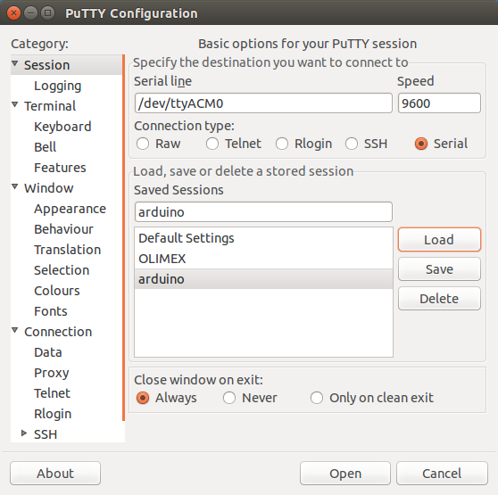

## USART

### Wat is USART?

De meeste MCU's hebben een USART-hardware-subsysteem.  
De USART hardware laat de AVR toe data te verzenden (tx) en te ontvangen (rx) van of naar andere devices (zoals je computer).  

USART verschilt van andere seriele protocollen in de zin dat het geen clock-lijn bevat.  
USART gebruikt 3 pinnen

* 1 voor transmit (tx) 
* 1 pin voor receive (rx)
* 1 pin voor een common ground

### Duiding: protocol

Een clock-rate wordt overeengekomen tussen de 2 apparaten/devices, die dan wordt gebruikt om de Rx/Tx lijnen te samplen.
USART gebruikt 2 pinnen 

* rx/tx staat hoog
* transmissie byte wordt aangekondigd/gestart door een start-bit met waarde 0
* de data is 1 byte (en wordt in omgekeerde volgorde verstuurd)
* transmissie byte wordt beeindigd/bevestigd door stop-bit 1

### Voorbeeld: trace

Hieronder heb je bijvoorbeeld een trace het versturen van het getal 10 (0xA of 00001010)


Als je deze trace vertaalt in bits kom je bij 1111100101000011111.  
Onderstaand sequentie toont hoe je dit kan ontleden: 

```
trace:    1111100101000011111
```

Verwijderen van de hoge bits voor en na start- en stop-conditie  

```
boodschap:     0010100001
```

Start- en stop-bit verwijderen  

```
ruwe data:      10100000
```

Ruwe data omdraaien  

```
byte:           00001010

```

### Registers: USART op de AVR

**UDR0: (data register)**

* Data-register
* Gedeeld tussen Rx/Tx

**UBRR0: (baud rate)**

* Definieren van de baudrate
* verspreid over 2 registers (short int)

**UCSR0A - UCSR0B - UCSR0C (control- en status-registers)**

* Rx complete (data ontvangen)
* Tx complete (data verstuurd)
* Enablen van tx en rx

### Duiding: baudrate

Het register UBRR0 dient om de baud-rate.  
Dit is de conventie tussen de 2 devices die aanduidt hoeveel signaal-wijzigingen (0 of 1 in dit geval) je per seconden kan hebben.

In de labo's gaan we een baudrate van 9600 toepassen, om te weten welke waarde we moeten gebruiken gebruiken we volgende rekenregel:  
```
baud-waarde = (F_CPU / 16 / BAUD_RATE) - 1
```

Toegepast op een 16Mhz-configuratie van een Arduino komt dit neer op:  
```
baud-waarde = (16Mhz/16/9600) - 1 = ~103
```
    
### Voorbeeld: schrijven naar de console

Dit programma print elke seconde het karakter a.

3 zaken worden geconfigureerd:

* Normale snelheid (keuze tussen normale en dubbele snelheid)
* Activatie van het lezen en schrijven
* Grootte van een word (byte)

De flag UDRE0 wordt gebruikt om na te kijken dat we data naar de buffer kunnen schrijven.

```{.c}
#include <util/delay.h>
#include <avr/io.h>

#define BAUD_RATE 9600
#define BAUD_RATE_DIVISOR (F_CPU / 16 / BAUD_RATE - 1)

#define LOOP_TOT_BIT_SET(sfr, bit) do { } while (bit_is_clear(sfr, bit))

int main(void) {

    UCSR0A =  0 << U2X0;//normale snelheid
    UCSR0B = 1 << RXEN0 | 1 << TXEN0;//activeer rx en tx
    UCSR0C =  1 << UCSZ01 | 1 << UCSZ00;//8 data bits 1 stop-bit

    UBRR0 = BAUD_RATE_DIVISOR;
    _delay_ms(11);

    while (1) {
        LOOP_TOT_BIT_SET(UCSR0A, UDRE0);
        UDR0 = 'a';
        _delay_ms(1000);
    }
    return 0;
}
```

### Voorbeeld: lezen en schrijven naar de console

Dit programma is gelijkaardig (configuratie blijft zelfde) maar zal na een seconde en echo van de byte geven:

* Wacht op input (RXC0-bit)
* Leest data-register uit
* Checkt of er geen data meer is in de tx-buffer (UDRE0-bit)
* Stuurt data terug maar telt 1 bij het karakter  
  Bijvoorbeeld als je a intikt komt het karakter b terug

```{.c}
#include <util/delay.h>
#include <avr/io.h>

#define BAUD_RATE 9600
#define BAUD_RATE_DIVISOR (F_CPU / 16 / BAUD_RATE - 1)

#define LOOP_TOT_BIT_SET(sfr, bit) do { } while (bit_is_clear(sfr, bit))

int main(void) {

    UCSR0A =  0 << U2X0;//normale snelheid
    UCSR0B = 1 << RXEN0 | 1 << TXEN0;//activeer rx en tx
    UCSR0C =  1 << UCSZ01 | 1 << UCSZ00;//8 data bits 1 stop-bit

    UBRR0 = BAUD_RATE_DIVISOR;
    _delay_ms(11);

    while (1) {
        LOOP_TOT_BIT_SET(UCSR0A, RXC0);
        unsigned char ontvangen = UDR0;
        LOOP_TOT_BIT_SET(UCSR0A, UDRE0);
        UDR0 = ontvangen + 1;
    }
    return 0;
}
```

### Tools: Communicatie met je PC

Het doel is dat je deze voorbeelden even uitprobeert, voor communicatie met je pc heb je een tool nodig die een seriele lijn (rx/tx) converteert naar USB.  
Deze chips USB-2-SERIAL, ftdi kan je apart kopen (prijs +- 5 €) let wel op dat je er 1 koopt die overeenkomt met de VCC van je MCU.


Goed nieuws echter voor de labo's.  
Arduinos heeft reeds een serial-naar-USB-converter hebben ingebouwd dus het is voldoende om je PC aan te sluiten.

### Tools: Communicatie met de MCU

Aan de kant van je PC heb je een terminal-programma nodig, dat een seriele connectie kan lezen. 
Zo'n terminal-programma moet je bij het opstarten 2 paramaters meegeven:

* Baud-rate, 9600 is gebruikelijk (moet natuurlijk dezelfde zijn als je AVR-programma)
* Device:
     * Voor Linux en Mac varieert dit (/dev/ttyUSB0, /dev/ttyUSB1, /dev/ttyACM0)  
       Je kan dmesg op command-line gebruiken om dit te weten komen (zowel op Linux als Mac)
     * Voor Windows is dit 1 van de COM-poorten

1 van de handige programma's die op alle besturingssytemen werkt Putty, het is éénvoudig in gebruik en je kan vooraf configureren:



Putty is ook beschikbaar voor Mac via MacPorts  
Alternatieven voor Mac en Linux:

* picocom -r -b 9600 /dev/ttyACM0
* screen 9600 /dev/ttyACM0


