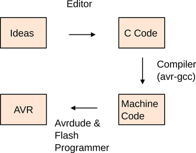
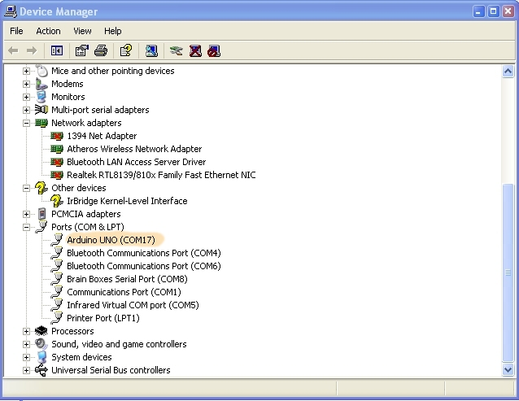

## Starten met tools: AVR toolchain (compilen en flashen)

We willen starten met het het compilen en flashen van een c-programma op een AVR-microcontroller.  
Hiervoor heb je 3 belangrijke onderdelen voor nodig:

* **avr-gcc**: versie van gcc getarget naar AVR
* **avrdude**: het programma dat praat met de programmer
* **gdb-avr**: een extensie op GDB om te kunnen debuggen (dit komt een later deel aan bod.

Dit deel legt uit:

* Hoe dat je deze tools moet installeren op verschillende OS
* Legt uit hoe dat je deze tools kan gebruiken vanuit command-line
* Legt uit hoe dat je via een seriele poort een programma kan downloaden op een Arduino

> **Nota:**  
> Deze voorbeelden zijn gegeven in de terminal.  
> 1-maal deze tools geïnstalleerd kan je in principe dit ook via Eclipse  
> (dit bekijken we later)


### Installatie AVR-compiler Linux

Bij linux-distributies is avr-gcc beschikbaar via de verschillende package-managers.

**Ubuntu, Mint en Debian:**  

Installatie via aptitude:   

```bash
$ sudo apt-get install avrdude avrdude-doc binutils-avr avr-libc gcc-avr gdb-avr
```

**Fedora en Red Hat:**   

Installatie via yum of dnf

```bash
# dnf install avrdude avr-gcc avr-binutils avr-libc avr-gdb
```

> Voor andere distributies zou je normaal gezien ook deze tools moeten kunnen installeren via een package-manager, best is even op het internet te zoeken.   
Let wel op bij het kiezen van een linux-distributie, er zijn gemakkelijke en minder gemakkelijke linux-distributies zijn om met te werken.  
> Als het om 1 of andere reden dan nog niet zou lukken zou je in principe alles nog zelf moeten kunnen compilen, voor meer info zie http://www.nongnu.org/avr-libc/user-manual/install_tools.html

### Installatie AVR-compiler Mac

Voor Mac is Crosspack de aangewezen installatie-software:

http://www.obdev.at/downloads/crosspack/CrossPack-AVR-20131216.dmg

Er zijn andere manieren maar:

* Deze is de meest gebruiksvriendelijke
* Er zijn ook geen dependencies op xcode of MacPorts (dus je moet niet specifiek een account maken)  

### Installatie Windows AVR-compiler (xp tem 10)  

Als je met Windows werkt is het aangeraden van WinAVR te installeren, deze installeert alles wat je nodig hebt om te werken met AVR's.  
Deze zal ook de nodige aanpassingen doen je environment-variabelen (PATH) zodat deze utilities direct beschikbaar zijn vanaf de command line.  

### Boven Windows 8

Vanaf Windows 8, werkt de installatie van WinAVR niet direct.  
Dit geldt ook voor AVR Studio alsook andere (commerciele) software gebouwd bovenop WinAVR(zoals ATMEL Studio)

Er zijn verschillende oplossingen hiervoor (zoals zelf compileren van WinAVR), de eenvoudigste manier is echter:

* Downloaden van de zip-file op toledo (bij het het hoofdstuk gerelateerd aan AVR-GCC)  
* De inhoud van deze file copieren en plakken in de folder "utils\\bin" onder de WinAVR-installatie

Voor meer info ivm deze oplossing, zie volgend forum http://www.avrfreaks.net/comment/1007906#comment-1007906

### Test-programma

Hieronder vindt je het voorbeeld-programma dat we hebben gebruikt bij de introductie van AVR:
Je mag dit programma gewoon kopiëren en plakken in een file genaamd led.c.

```c
#include <avr/io.h>
#include <util/delay.h>

int LED_NUMMER = PB5;

int main(void)
{
  DDRB |= (1<<LED_NUMMER);

  while (1)
  {
      PORTB |= (1<<LED_NUMMER);
      _delay_ms(500);
      PORTB &= ~(1<<LED_NUMMER);
      _delay_ms(500);
  }
  return 0;
}
```

1 maal dat je deze file hebt bewaard kan je starten aan de volgende stap (compilen en builden)

### Compileren van de code

Net als we hebben gezien voor X86-programma's (computer) kan je C-code vertalen naar een programma voor een MCU.



Hoe starten?

* Bewaar het onderstaande programma op je harde schijf (lokaal niet op het netwerk)
* Noem dit programma led.c zodat je de volgende lijnen hieronder "kan copy/pasten"
* Navigeer via command line (terminal, cmd, bash, ...) naar de directory waar je code staat

Voer daarna de volgende 4 commando's uit (vervang /dev/ttyACM0 door de specifieke poort waar de Arduino is op aan gesloten):

* **Compilatie:**  
  avr-gcc -Os -DF_CPU=16000000UL -mmcu=atmega328p -c -o led.o led.c
* **Linken:**  
  avr-gcc -mmcu=atmega328p led.o -o led
* **Omzetten naar een hex-file:**  
  avr-objcopy -O ihex -R .eeprom led led.hex

> **Let wel:**  
> Deze voorbeelden werken identiek op alle operating-systemen (terminal/console), met uitzondering van het laatste commando.  
> Dit wordt in het volgende stuk uitgelegd.

### Flashen van het programma

Na het compilen van je code heb je een binaire file (programma) die we op de controller moeten krijgen.   
We noemen dit ook wel het flashen of programmeren van de MCU.

Je kan dit met het volgende commando voor de Arduino:

```bash
avrdude -F -V -c arduino -p ATMEGA328P -P /dev/ttyACM0 -b 115200 -U flash:w:led.hex
```

Dit commando gaat avrdude instrueren van het programma over een seriele poort te laden naar de Arduino.  
De arduino UNO - die wij in deze fase van het labo gebruiken - laat toe onze programmas op te laden zonder extern device/toestel.  
Dit is mogelijk gezien op de MCU (ATMEGA328P) een programma's op te laden over een seriële verbinding (alle bits 1 voor 1 in constrast met een parallele lijn...).  

> **Bemerking:**  
> Technisch gezien gaat het hier over de emulatie van een seriele poort over USB  
> In het hoofdstuk over seriele communicatie komen we hier in detail op terug.

Dit commando is gelijkaardig voor de meesten operating-systemen en setup's maar:

* De **naam** van de **seriele poort** (die na het -P argument komt) zal **verschillen** (voorbeeld komt van een Linux-OS)
* Afhankelijk van het **OS** moet je een aantal zaken **voorbereiden**

We bespreken dit per OS:

### Windows

**Installatie van driver-informatie**  

Voor Windows moet je een specifieke driver-file (tekst-file die eindigt op inf) registreren om te kunnen flashen.
Hiertoe zijn 2 mogelijkheden:

* Je installeert de volledige Arduino-software omgeving en deze driver worden geladen  
  https://www.arduino.cc/en/Main/Software
* Je volgt de instructies in punt 4 van https://www.arduino.cc/en/Guide/Windows  
  (rechstreeks laden van inf-files, zie ook https://en.wikipedia.org/wiki/INF_file)

**Naam van de com-port**

Voor Windows moet je de je in het avrdude-commando "-P /dev/ttyACM0" vervangen door "-P COMX", waar X moet vervangen worden door het nummer van deze COM-poort.  
Deze nummer kan je te weten komen door naar de "Device Manager" in Windows te navigeren en dit zo te gebruiken.



Met bovenstaande com-poort (COM17) kan je dan het volgende commando gebruken:

```bash
avrdude -F -V -c arduino -p ATMEGA328P -PCOM17 -b 115200 -U flash:w:led.hex
```

### Linux

Voor Linux heb je geen specfieke driver-file nodig zoals voor Windows.

**Naam van de seriele port**

De poort is in vele gevallen is /etc/ttyACM0, dit kan echter verschillen in sommige gevallen (/dev/ttyACM1, /dev/ttyACM2, ...).

Als je zeker wil zijn kan je altijd gebruik maken van de soft-links die zich in /dev/serial-folder bevinden

```bash
$ ls -l /dev/serial/by-id/
total 0
lrwxrwxrwx 1 root root 13 Feb 29 21:15 usb-Arduino__www.arduino.cc__Arduino_Uno_64935343333351F08192-if00 -> ../../ttyACM0
```

**Dialout-user-group**

In linux-distributies moet je wel zorgen dat je als user onder de dialout-user-group geregistreerd bent.

```bash
$ ls -l /dev/ttyACM0
crw-rw---- 1 root dialout 166, 0 Feb 29 21:15 /dev/ttyACM0
```

Dit kan je met het volgende commando doen (waar je naam door je user-name wijzigt):

```bash
$ sudo usermod -a -G dialout naam
```

(Daarna dien je wel in en uit te loggen)

```bash
avrdude -F -V -c arduino -p ATMEGA328P -P /dev/ttyACM0 -b 115200 -U flash:w:led.hex
```

### Mac

Bij Mac is de aanpak gelijkaardig aan Linux maar moet je deze laastse stap niet uitvoeren.

**Naam van de seriele port**

De poort-naam start meestal met /dev/tty.usbmodem... gevolgd door een nummer van 4 cijfers.  
Door het volgende commando zal je de poort naam terugvinden.

```bash
$ ls -l /dev/tty.usb*
crw-rw-rw-  1 root  wheel   18,   2 29 feb 21:32 /dev/tty.usbmodem1411
$
```

En het commando is dan:

```bash
avrdude -F -V -c arduino -p ATMEGA328P -P /dev/tty.usbmodem1411 -b 115200 -U flash:w:led.hex
```

### Command-line voorbeeld

Als besluit alle stappen nog bij elkaar:

* Eerst voer je de 3 eerste commando's uit om tot een (door AVR) uitvoerbaar bestand te komen:

```
$ avr-gcc -Os -DF_CPU=16000000UL -mmcu=atmega328p -c -o led.o led.c
$ ls
led.c  led.o
$ avr-gcc -mmcu=atmega328p led.o -o led
$ ls
led  led.c  led.o
$ avr-objcopy -O ihex -R .eeprom led led.hex
$ ls
led  led.c  led.hex  led.o
```

* Daarna download je de hex-file naar de microcontroller:

```
$ avrdude -F -V -c arduino -p ATMEGA328P -P /dev/ttyACM0 -b 115200 -U flash:w:led.hex

avrdude: AVR device initialized and ready to accept instructions

Reading | ################################################## | 100% 0.00s

avrdude: Device signature = 0x1e950f
avrdude: NOTE: "flash" memory has been specified, an erase cycle will be performed
         To disable this feature, specify the -D option.
avrdude: erasing chip
avrdude: reading input file "led.hex"
avrdude: input file led.hex auto detected as Intel Hex
avrdude: writing flash (176 bytes):

Writing | ################################################## | 100% 0.04s

avrdude: 176 bytes of flash written

avrdude: safemode: Fuses OK (E:00, H:00, L:00)

avrdude done.  Thank you.

```

* Als alles goed verlopen is krijg je bovenstaande output
