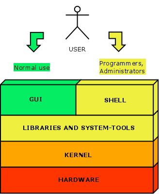
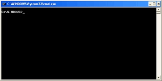

## Tools: Werken met een shell

### Wat is een shell?

Een shell is een programma dat rechtstreeks toegang heeft tot een

* Aanmaken/verwijderen/hernoemen/... van een files en foldes
* Starten van programma's

Een shell is (om het simpel te houden) een tool die je een toegang geeft om low-level systeem-taken uit te voeren:

* Opstarten van programma's 
* Navigeren door een file-systeem
* Manipuleren files en folders
* Controleren en monitoren van processen
* Automatiseren van taken
* ...

### Tekst-commando's

Een **shell** of **CLI** (command-line-interface) zorgt ervoor dat een gebruikers deze taken kunnen uitvoeren via **tekst-commando's**.  

Deze tekst-commando's kunnen meestal ook **gebundeld** worden in een **script** (dat je dan kan uitvoeren van een CLI net zoals je programma's kan uitvoeren)   

Nadat zo'n commando/script/programma is uitgevoerd krijgt de gebruiker weer de kans om de shell of het programma aan te spreken door op de opdrachtregel een nieuwe opdracht op te geven.  

### Waarom werken met een shell

Om het kort te houden, het is een tool die moet gekend zijn als je wil programmeren omdat we deze vaardigheden nodig hebben om later met toolchains (compiler en linkers) om te gaan.  

Elke software-ontwikkelaar moet de beginselen kennen van het werken met command-line.  
Dit argument is nog sterker als je met embedded devices werkt die veelal enkel te besturen zijn via command-line

  
### Terminal op Windows

Elk operating system bevat een CLI, Windows bevat hiervoor het programma CMD, dat je kan vinden in het windows-menu onder "administrative tools".

> De Windows commando's hebben echter hun beperkingen.  
> Vandaar dat er alternatieven bestaan als **MingW/MSYS** die je een Bash-compatibele omgeving meebrengen (zodat je gelijkaardige commando's als Linux kan uitvoeren)

### Terminal op Linux

Elke linux-distro heeft 1 of meerdere terminal-emulators zoals:  

* GNOME Terminal
* Terminator
* Guake
* ...

> Een andere optie is Linux opstarten zonder grafische shell (X-server)

Deze terminal-emulator zullen een bash-shell aanbieden, deze deelt een aantal commando's met het windows-cmd maar is in principe veel uitgebreider

### Terminal op MAC OS X

In MAC OS X kan je de terminal bereiken via Programma’s - Hulpprogramma’s - Terminal
Net zoals bij Linux is de terminal omgeving gebaseerd op Bash (Bourne Again Shell) en kan je dezelfde commando's uitvoeren

### Windows commando's voorbeeld

We gaan het gebruik van deze een terminal demonstreren op Windows.  
Bedoeling is dat we het resultaat van deze oefening achteraf terug gebruiken voor onze eerste oefening met een compiler.  

#### Windows shell openen

Afhankelijk van de windows-versie open je via het menu (onder "accessoires" of "administrative tools") het programma CMD

~~~
Microsoft Windows [Version 6.1.7601]
Copyright (c) 2009 Microsoft Corporation.  All rights reserved.

C:\Users\A590649>
~~~

#### Een directory aanmaken

We kunnen een directory aanmaken:

~~~
C:\Users\A590649>mkdir een_eerste_programma

C:\Users\A590649>dir
 Volume in drive C is System
 Volume Serial Number is E687-8D34

 Directory of C:\Users\A590649

...
02/02/2017  14:08    <DIR>          een_eerste_programma
...
~~~

Door het commando dir te typen kunnen we de inhoud zien van de huidige directory

#### Navigeren door directories

Als je deze directory hebt aangemaakt kan je hiernaartoe navigeren via het commando cd (change directory)

~~~
C:\Users\A590649>cd een_eerste_programma

C:\Users\A590649\een_eerste_programma>cd ..

C:\Users\A590649>
~~~

Je kan terug naar een hogere directory navigeren door cd te laten volgen door ..

#### Directories verwijderen

Een directory kan verwijderd worden door het commando rmdir (deze mag wel geen files bevatten)

~~~
C:\Users\A590649>rmdir een_eerste_programma

C:\Users\A590649>cd een_eerste_programma
The system cannot find the path specified.
~~~

Als je nadien naar deze directory probeert te gaan krijg je een boodschap dat deze directory niet bestaat.

#### Files in een directory

We maken opnieuw een directory aan, deze keer navigeren we ook naar deze directory.

~~~
C:\Users\A590649>mkdir mijn_eerste_programma

C:\Users\A590649>cd mijn_eerste_programma

C:\Users\A590649\mijn_eerste_programma>dir
 Volume in drive C is System
 Volume Serial Number is E687-8D34

 Directory of C:\Users\A590649\mijn_eerste_programma

02/02/2017  14:15    <DIR>          .
02/02/2017  14:15    <DIR>          ..
               0 File(s)              0 bytes
               2 Dir(s)  123.086.462.976 bytes free
~~~

Vervolgens maken we via een texteditor (notepad++ zoals eerder besproken) aan en copieren we volgende inhoud:

~~~c
#include <stdio.h>

int main()
{
	printf("Hello World\n");
	return 0;
}
~~~

en bewaren we deze file onder de eerder aangemaakte directory onder de naam hello.c.

Nadien kijken we dit na met het DIR-commando:

~~~
C:\Users\A590649\mijn_eerste_programma>dir
 Volume in drive C is System
 Volume Serial Number is E687-8D34

 Directory of C:\Users\A590649\mijn_eerste_programma

02/02/2017  14:25    <DIR>          .
02/02/2017  14:25    <DIR>          ..
02/02/2017  14:24                77 hello.c
               2 File(s)            471 bytes
               2 Dir(s)  123.097.833.472 bytes free
~~~

#### Inhoud van een file tonen op command-line

De inhoud van deze file kan men ook op de command-line afdrukken door het commmando type

~~~
C:\Users\A590649\mijn_eerste_programma>type hello.c
#include <stdio.h>

int main()
{
        printf("Hello World\n");
        return 0;
}
C:\Users\A590649\mijn_eerste_programma>t
~~~

#### Copieren van een file

Je kan ook een file via de terminal copieren via het commando COPY

~~~
C:\Users\A590649\mijn_eerste_programma>copy hello.c hello.txt
        1 file(s) copied.

C:\Users\A590649\mijn_eerste_programma>dir
 Volume in drive C is System
 Volume Serial Number is E687-8D34

 Directory of C:\Users\A590649\mijn_eerste_programma

02/02/2017  14:34    <DIR>          .
02/02/2017  14:34    <DIR>          ..
02/02/2017  14:24                77 hello.c
02/02/2017  14:24                77 hello.txt
               2 File(s)            154 bytes
               2 Dir(s)  123.095.646.208 bytes free
~~~

Gezien we deze niet nodig hebben voor het vervolg van onze cursus gebruiken we het DEL-commando om deze file te verwijderen

~~~
C:\Users\A590649\mijn_eerste_programma>del hello.txt

C:\Users\A590649\mijn_eerste_programma>dir
 Volume in drive C is System
 Volume Serial Number is E687-8D34

 Directory of C:\Users\A590649\mijn_eerste_programma

02/02/2017  14:35    <DIR>          .
02/02/2017  14:35    <DIR>          ..
02/02/2017  14:24                77 hello.c
               1 File(s)             77 bytes
               2 Dir(s)  123.094.589.440 bytes free

C:\Users\A590649\mijn_eerste_programma>
~~~

#### Output van een file afleiden

We kunnen de output van een programma (of een commando zoals DIR) afvangen en omleiden naar een andere file zoals hieronder.

~~~
C:\Users\A590649\mijn_eerste_programma>dir > een_file

C:\Users\A590649\mijn_eerste_programma>type een_file
 Volume in drive C is System
 Volume Serial Number is E687-8D34

 Directory of C:\Users\A590649\mijn_eerste_programma

02/02/2017  14:50    <DIR>          .
02/02/2017  14:50    <DIR>          ..
02/02/2017  14:50                 0 een_file
02/02/2017  14:24                77 hello.c
               2 File(s)             77 bytes
               2 Dir(s)  123.089.620.992 bytes free

C:\Users\A590649\mijn_eerste_programma>del een_file
~~~

Met dit voorbeeld sluiten we deze oefening af, verwijder deze folder voorlopig nog niet gezien je dit nog nodig gaat hebben in het volgende deel...

