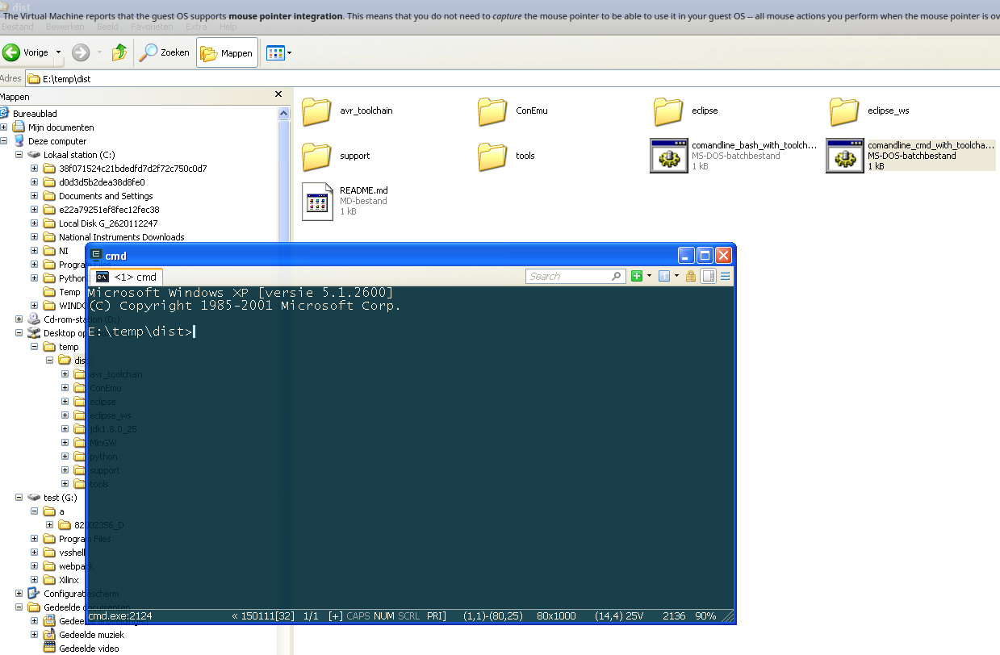
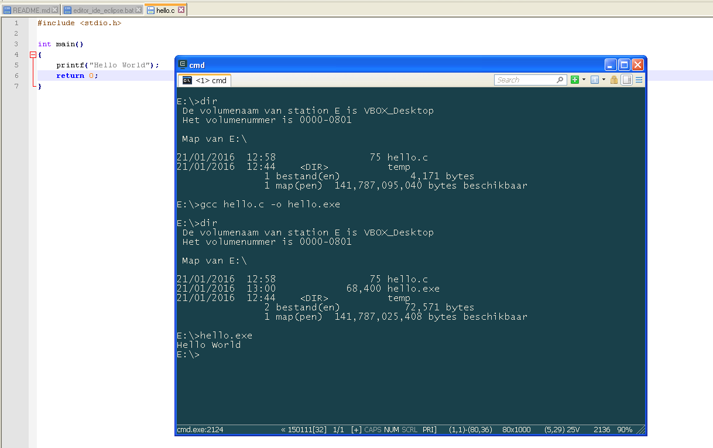

## Starten met tools: Command line

Elke software-ontwikkelaar (en zeker als je met MCU's werkt) moet de beginselen kennen van het werken met command-line.  
Dit argument is nog sterker als je met embedded devices werkt die veelal enkel te besturen zijn via command-line

### Keuze van een teksteditor

Om C te programmeren heb je een tekst-editor nodig.  
Let wel, dit niet te verwarren met tekstverwerkings-programma's zoals Word, LibreOffice, Pages!!!

Voor Windows kan je notepad hiervoor gebruiken, maar er zijn betere keuzes zoals:

* Notepad++
* PSpad Editor
* Atom
* ...

Deze editors hebben (in tegenstelling tot notepad) eigenschappen zoals:

* *Text coloring:*  
  Bepaalde elementen (variabelen, loops, functies, ...) worden in een andere kleur geplaatst om de leesbaarheid te verhogen.  
* *Code completion:*  
  De editor kan intelligent zijn door bijvoorbeeld code die gedeeltelijk is ingevuld automatisch aan te vullen
* ...

Voor Linux heb je een scala aan keuze:

* GEdit (zeer eenvoudig)
* Scitext
* Atom
* Kate
* Leaf-pad
* ...

Voor Mac:

* TextMate
* TextWrangler
* XCode
* ...

Dit zijn allemaal grafische text-editors en zijn over het algemeen zeer éénvoudig om mee te werken.  
Deze hebben wel het nadeel dat je altijd tussen een command line en je editor moet wisselen, hievoor zijn er 2 alternatieven:

* Command-line editors
* IDE's, integrated development environments die zowel tekst-editors

#### Command-line editors

Voor de meer gevorderden zijn er Linux- en Mac zijn er zeer goede tekst-editors die je via de command-line bestuurt:

* Vim
* emacs
* nano
* ed
* ...

Deze zijn zeer krachtige editors die wel een zekere leercurve hebben (dus als je die voor de eerste maal probeert moet je wel wat tijd vrijmaken)

> **Windows:**  
> Deze command-line-editors zijn ook beschikbaar in Windows via Cygwin of Mingw (later meer hierover)

### Toolchain GCC: Linux

Op linux-distributies kan je gcc installeren via de package-managers

**Ubuntu, Mint, Debian:**

~~~
$ sudo apt-get install gcc
~~~

**Fedora, Red Hat:**

~~~
# dnf install gcc
~~~

### Toolchain GCC: Windows

Voor Windows moet je een Mingw installeren op je machine.   
Er is echter een zip-file voor de cursus voorzien die alle tooling voorziet zonder dat je iets moet installeren (of zelfs administratie-rechten).
We komen hier zo dadelijk op terug.

### Toolchain GCC: Mac

Als je het programma gcc aanroept **via command-line** zal OS X je voorstellen om gcc (of clan) te installeren.  
Laat de installatie gewoon lopen.


### CLI/shell/terminal

Een **shell** of **CLI** (command-line-interface) zorgt ervoor dat een gebruiker:

* via tekst-**commando's** (acties) kan uitvoeren naar een **programma** toe
* in meeste gevallen het operating system zelf (maar soms ook specifiek programma's met een CLI)
* deze tekst-commando's kunnen meestal ook **gebundeld** worden in een **script** (dat je dan kan uitvoeren van een CLI)   
* nadat de opdracht is uitgevoerd krijgt de gebruiker weer de kans om de shell of het programma aan te spreken door op de opdrachtregel een nieuwe opdracht op te geven.  

De CLI geldt als tegenhanger van de grafische gebruikersomgeving (ofwel de GUI, Graphical User Interface).  

> **Nota:**  
> Als voorbeeld van zo'n **GUI**-omgeving gaan we later nog **Eclipse** bekijken maar we starten bij de basis en dat is command-line.  

### Starten met CLI

Elk operating system bevat een CLI:

**Linux**

In Linux kan je dit via een terminal-emulator zoals:  

* GNOME Terminal
* Terminator
* Guake
* ...

Een andere optie is Linux opstarten zonder grafische shell (X-server)

**Windows**

In Windows heb je de keuze tussen de programma's (meestal te vinden bij de adminstratieve tools):

* CMD
* Powershell
* ConEmu (te installeren)

De Windows commando's hebben echter hun beperkingen.  
Vandaar dat er alternatieven bestaan als **MingW/MSYS** die je een Bash-compatibele omgeving meebrengen (zodat je gelijkaardige commando's als Linux kan uitvoeren)

**MAC OS X**

In MAC OS X kan je de terminal bereiken via Programma’s - Hulpprogramma’s - Terminal
Net zoals bij Linux is de terminal omgeving gebaseerd op Bash (Bourne Again Shell) en kan je gelijkaardige commando's uitvoeren

**FreeBSD**

Gelijkaardig aan Linux en Mac OS X

### Algemene commando's

Een zeer kort overzicht van commando die nodig heb om te navigeren en file-manipulatie:

#### Naar een directory gaan

**cd** directorypath:  
Wijzigen huidige directory  
**cd ..**  
1 directory naarboven  
**cd**  
naar je home directory  

#### Oplijsten van files binnen een directory

**dir**:  
directory inhoud Windows  
**ls**:  
directory inhoud Mac/Linux  
**ls -al**:  
alle bestanden inclusief de verborgen bestanden met extra informatie  

#### Afdrukken huidige directory

**echo %cd%**  
wat is je huidige directory in Windows

**pwd**  
wat is je huidige directory in Mac/Linux

#### Aanmaken van een directory

**mkdir**  
Maar een directory aan

#### Output van een commando

**>>**  
de output van een commando naar een file afleiden (kan gemakkelijk zijn als je wil loggen naar een file)
**>**  
zelfde als vorige commando maar zal toevoegen aan een bestaande file

**Voorbeeld:**  
Het commando ```ls -al > hello.txt``` zal bijvoorbeeld een file hello.txt maken met de inhoud van een directory

### Een C-programma op command-line bouwen (voorbereiding voor Windows-gebruikers)

**Stap 1:** **Download** de **zip**-file (https://www.dropbox.com/s/8ooj6ab89vj92dm/cursus_mcu_tools.zip?dl=0)  

**Stap 2:** Unzip deze file en je krijgt een directory structuur (binnen een folder dist)



**Stap 3:** Maak een C-file in een teksteditor (dist\\tools\\Notepad++Portable\\Notepad++Portable.c) en bewaar die ergens op je harde schijf

~~~c
#include <stdio.h>

int main()
{
	printf("Hello World");
	return 0;
}
~~~

**Stap 4:** Open de command-line tool en navigeer naar de plaats waar de file staat.

**Stap 5:** Voor de volgende command-line instructies uit (uitleg over C volgt later)

~~~
E:\>gcc hello.c -o hello.exe

E:\>dir
 De volumenaam van station E is VBOX_Desktop
 Het volumenummer is 0000-0801

 Map van E:\

21/01/2016  12:58                75 hello.c
21/01/2016  13:00            68,400 hello.exe
21/01/2016  12:44    <DIR>          temp
               2 bestand(en)           72,571 bytes
               1 map(pen)  141,787,025,408 bytes beschikbaar

E:\>hello.exe
Hello World
E:\>
~~~




### Een C-programma op command-line bouwen (GCC)

GCC is een command-line-tool die c-code kan omzetten naar een uitvoerbaar bestand

Compilen (van een C-programma) wordt uitgevoerd in 2 stappen:

* **Compileren:**  
  De C-files worden elk omgezet naar een object-file (extensie .o).  
  Hier wordt de C-code reeds vertaald naar machine-taal
* **Linken:**  
  Hier worden 1 of meerdere object files met elkaar verbonden (en eventueel gelinkt aan externe libraries)

> **Belangrijke bemerking:**  
> Later gaan we hier veel verder op ingaan, momenteel moeten we enkel weten wat je moet doen om een éénvoudig C-programma om te zetten naar een uitvoerbaar bestand.


**Stap 1: code schrijven**  
Je schrijft je code naar een bestand en geeft dit een naam met de extensie C.  

```c
#include <stdio.h>

int main()
{
	printf("!!!Hello World!!!");
    return 0;
}
```

**Stap 2: compileren**  
Je **compileert** deze C-code naar een object-file (extensie .o).  

Deze **object-file** is niet het uiteindelijk uitvoerbaar bestand, maar eerder een tussenbestand dat je toelaat van meerdere C-files in bouwen (build) van een programma.  

Een object-file bevat reeds de machine instructies van je programma, maar moet in de volgende stap nog gelinkt worden aan libraries (en eventueel andere objects).  
Binnen een paar lessen komen we hier nog uitgebreider op terug als we grotere programma's maken.


```{.sh}
$ ls
hello.c
$ gcc -c hello.c
$ ls
hello.c  hello.o
```

**Stap 3: linken**  
Van 1 of meerdere object-files en libraries kan je een uitvoerbaar bestaand (programma) maken door te **linken**.  
Voorlopig werken we met maar 1 source file dus onderstaande command-line volstaat.

```{.sh}
$ gcc hello.o -o hello
```

**Uitvoeren:**  
Daarna kan je het programma uitvoeren door de naam te typen  
(voorafgegaan door ./  om aan te duiden dat het bestand in deze diretory staat, in Windows dit is .\\)

```{.sh}
$ ./hello
!!!Hello World!!!
$
```

> **Bemerking:**  
> In Windows gebruik je voor een uitvoerbaar bestand de extensie .exe, dus het laaste commando is dan ```gcc hello.o -o hello.exe```

### Linken en compilen tegelijk met GCC  

Je kan gcc ook tegelijkertijd laten compileren en linken zodat je direct een uitvoerbaar bestand kijkt:

```{.sh}
$ ls
hello.c
$ gcc hello.c -o hello
$ ls
hello.c  hello
$ ./hello
!!!Hello World!!!
$
```

Dit is een veréénvoudigde manier die we de eerstvolgende lessen gaan gebruiken.  
Het vorige voorbeeld is echter belangrijk om te beseffen dat achter het bouwen van een C-programmen hierachter verschillende processen zitten zoals:

* Compilen
* Linken
* Preprocessing
* ...

We gaan in de volgende hoofdstukken deze verschillende bouwstenen/processen verder uitleggen en verdiepen.
