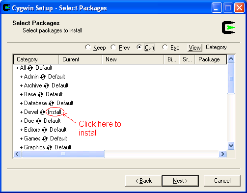
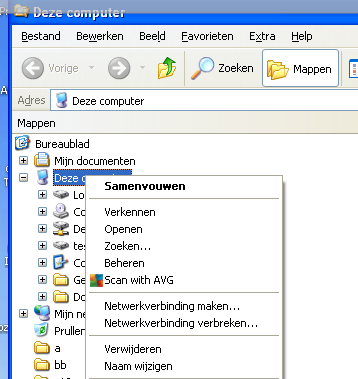
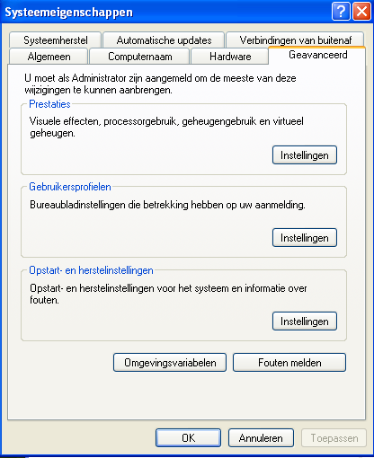
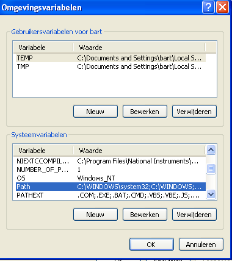
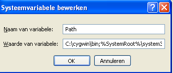

## Installatie GCC op Windows

GCC kan je installeren op Windows via Cygwin.  

Cygwin vooorziet in een Unix compatibele omgeving voor Windows, dit zorgt ervoor dat je tools bedoeld voor POSIX-systemen (Linux, Unix, BSD, ...) kan gebruiken op Windows.

### Installatie Cygwin

Standaard kan  je Cygwin installeren door de installer te downloaden, deze vind je  

* Te https://cygwin.com/setup-x86_64.exe voor 64-bit
* Te https://cygwin.com/setup-x86.exe voor 32-bit

Als je voorgaande optie (pre-geconfigureerd) niet wil gebruiken kan je de instructies volgen op de website  https://cygwin.com/install.html

Cygwin is (zoals eerder vermeld) een verzameling van tools, zorg er zeker voor dat je gcc mee installeert (niet altijd by default).  

Zorg er voor dat je categorie "Devel" aanduidt opdat deze GCC en aanverwante tools installeert, zoals geillustreerd hierboven.

### PATH-variabele instellen

gcc wordt - in het eerste deel van deze cursus - gebruikt vanaf de DOS-prompt (voor degene die met Windows werken tenminste).

Opdat de DOS-prompt GCC (en verwante tools en libraries) kan vinden dien je de PATH-environment-variabele aan te passen.

Deze environment-variabele (zie het voorgaande stuk over het gebruik van command-line) wordt door het operating-systeem gebruikt om te weten waar het mag zoeken voor uitvoerbare bestanden.

Dit kunnen we instellen op 2 manieren:

* Via de command-line (1-malig)
* Via de administratie-settings

#### Via de command-line-tool

Dit is niet de geprefereerde manier (omdat je die telkens opnieuw moet uitvoeren als je een DOS-prompt opent), maar dient echter als **basis** van de **volgende oplossing**.

> Ook als je geen adminstratie-rechten hebt op je computer kan deze manier je uit de nood helpen

De **PATH**-environment-variabele bevat **1 of meerdere (absolute) paden** die verwijzen naar directories waar **executables te vinden** zijn.  
Deze verschillende paden zijn van elkaar gescheiden door een **;**

Volgende DOS-sessie toont aan hoe je gcc door de command-line kan doen herkennen:

~~~bat
Microsoft Windows XP [versie 5.1.2600]
(C) Copyright 1985-2001 Microsoft Corp.

C:\Documents and Settings\bart>echo %PATH%
C:\WINDOWS\system32;C:\WINDOWS;C:\WINDOWS\System32\Wbem

C:\Documents and Settings\bart>gcc
gcc wordt niet herkend als een interne
of externe opdracht, programma of batchbestand.

C:\Documents and Settings\bart>set PATH=c:\cygwin\bin;%PATH%

C:\Documents and Settings\bart>echo %PATH%
C:\cygwin\bin;C:\WINDOWS\system32;C:\WINDOWS;C:\WINDOWS\System32\Wbem

C:\Documents and Settings\bart>gcc
gcc: fatal error: no input files
compilation terminated.

C:\Documents and Settings\bart>
~~~

> De echo-commandos dienen enkel om de inhoud te tonden van deze variabele (optioneel dus)

Het SET-commando zorgt er voor dat de inhoud van PATH wordt aangevuldvuld met het path C:\cygwin\bin.  
Door dit te combineren met %PATH% blijf de oorspronkelijke inhoud ook behouden.

Het resultaat is dat na deze set-operatie gcc kan worden uitgevoerd (je mag de bijhorende foutboodschap negeren)

> Let wel de ; niet tussen deze paden te behouden zoals geillustreerd

#### Via de system-settings

Het probleem met voorgaande oplossing is dat je deze telkens opnieuw moet uitvoeren.  
Je kan echter dit PATH ook manipuleren met de system-settings.

Ga naar de system-settings, dit kan je door met de rechter-muisknop te klikken op "My Computer" en eigenschappen (of properties) te kiezen.

Daarna ga je naar de tab "Geavanceerd" (Advanced).  
Daar klik je op de button "Omgevingsvariabelen" (environment variables)

Daar zoek je bij systeem-variabelen achter PATH, selecteer je deze en klik op "Bewerken" (edit)

In de tekst die je dan ziet voeg je het pad naar de cygwin-installatie toe, vergeet wel niet af te sluiten met een ;

Als je daarna een nieuwe command-line opent zal je zien dat de inhoud van PATH gewijzigd is, en gcc kan aanroepen...

~~~bat
Microsoft Windows XP [versie 5.1.2600]
(C) Copyright 1985-2001 Microsoft Corp.

C:\Documents and Settings\bart>echo %PATH%
C:\cygwin\bin;C:\WINDOWS\system32;C:\WINDOWS;C:\WINDOWS\System32\Wbem

C:\Documents and Settings\bart>gcc
gcc: fatal error: no input files
compilation terminated.

C:\Documents and Settings\bart>
~~~
