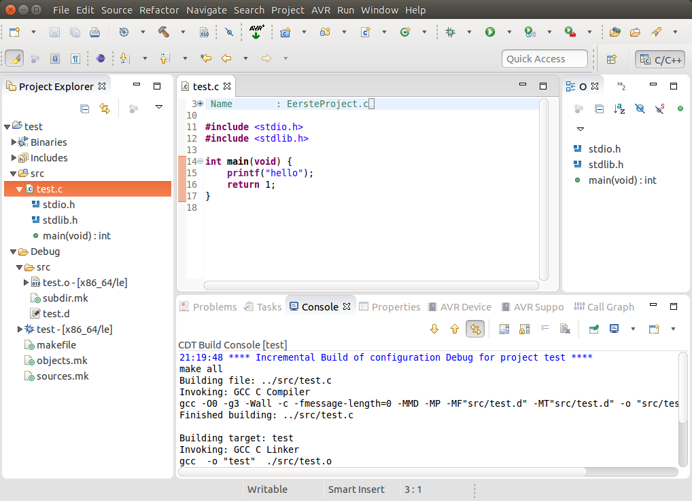
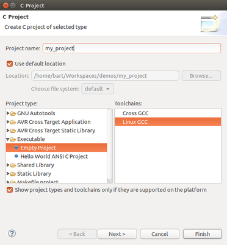

## Starten met tools: Eclipse IDE

In deze handleiding wordt kort beschreven:

* Hoe Eclipse werkt
* Hoe je met Eclipse C-programma's kan schrijven
* Bij uitbreiding een aantal tips om met Eclipse te werken

> **Let wel:** bedoeling is van net voldoende duiding te geven dat je kan starten met Eclipse.  
> Hier en daar worden wat hints gegeven, beschouw dit echter niet als een referentie.  
> Een handleiding van Eclipse zou meerdere boeken vullen, dus je bent uitgenodigd Eclipse ook zelf ter verkennen aan de hand van de vele tutorials op het web.

Eclipse is een opensourceframework van de Eclipse Foundation voor software-ontwikkellingsomgevingen (IDE of Integrated Development Environment).
  
Oorspronkelijk was Eclipse vooral populaire voor Java-ontwikkelin, maar vandaag de dag is Eclipse populair voor zowat alle programmeertalen (Java, C, Python, Ruby, C++, Javascript, Scala, Groovy, Cobol,...).  
Het is 1 van de meest populaire ontwikkelingsomgevingen die er bestaan (en bijna standaard als het om niet microsoft onwikkeling).

Eclipse heeft ook een heel modulaire architectuur die het toelaat van zeer gemakkelijk uitbreidingen (of plugins) te schrijven.  
Dit gaan we later in de cursus gebruik door bijvoorbeeld plugins te gebruiken die de integratie met AVR's vergemakkelijken.  

### Instalatie van Eclipse

Om eclipse te gebruiken heb moet je de volgende zaken (in volgorde) installeren:

* GCC-compiler  
  (Windows via Mingw, bij de meeste distributies standaard, Mac via XCode)
* Een java (jdk or jre) bij voorkeur een recente versie  
  (download en installeren voor Mac en Windows, voor Linux gebruik je meestal een package-manager)
* Eclipse (de CDT-versie)

### Workspace  

Als je eclipse opent krijg je een venster te zien om een workspace te selecteren(Workspace Launcher).  
Of wel kies je een bestaande workspace ofwel maak je een nieuwe aan door een path te selecteren.    
Deze workspace is een sandbox die een aantal projecten bevat (en eventueel wat extra configuratie-).  
 
### Projecten

Een project (zeker in de context van een c-applicatie) stelt een c-applicatie voor.  
Dit project mag verschillende c-files (en header files) bevatten.

### Concept: Workspace en projecten 

In Eclipse kan je de code structureren aan de hand van 2 elementen: 

* Workspace
* Projecten

Een project komt meestal overeen met een applicatie (in ons geval een C-applicatie).  
In zo'n project plaats je alle verschillende files die je nodig hebt om zo een C-applicatie op te bouwen  
(meetal C-files maar zoals we later gaan zien kunnen zijn er ook nog andere types).

Eclipse organiseert deze projecten in zogeheten workspaces.  
Een workspace is eigenlijk een map met een aantal referenties naar projecten die alle instellingen met elkaar delen. 

### Stap: Van start gaan

Als je Eclipse opent krijg je een venster "Workspace Launcher"; hierin kies je een 
bestaande workspace of wijs (via de knop Browse) een nieuwe workspace aan.  

Je kan een workspace in Eclipse customizeren, deze kan je instellen door uit het menu Window | Preferences te selecteren.  
We gaan niet alle preferences overlopen (rtfm, in principe werkt Eclipse ook zonder deze te zetten), daarvoor ben je uitgenodigd eens door de verschillend items te lopen.  

> Afhankelijk van het OS en environment-variabelen nog wat settings aanvullen om van start te kunnen gaan.  
> De meegeleverde Window-Eclipse (geleverd in de cursus) is reeds pre-configureerd maar indien je zelf wil configureren moet je naar de OS-specifieke documentatie gaan kijken.  
> Voor andere OS is dit gedocumenteerd in de OS-specifieke hoofdstukken. 

### Opbouw van eclipse

 
De basisstructuur van Eclipse (na het openen) zie je hierboven.  
Het bevat verschillende segmenten:

* **"Project Explorer"** (links)      
Overzicht van all projecten en de files die deze bevatten
    * src-folder:   
      bevat de c-files (en andere soorten files die we later zien)
    * Debug/src
      bevat het resultaat van de compilatie
* **Editor Pane** (midden met source-code)  
Als je op een tekst-file dubbel-klikt zal deze openen in dit gedeelte
Je kan deze gebruiken om c-files te bewerken.  
Je kan vanzelfsprekend meerdere files gelijktijdig openen en navigeren hiertussen.  
* **Console** (onderaan)  
Eclipse voert om de source-code te compilen/bouwen commando's (zoals command-line) uit.  
Het detail van de compilatie, eventueel boodschappen en of errors/warnings kan je hier bekijken.  
* **Outline** (rechts)  
Bevat een overzicht en structuur van de c-code die in je editor is geopend.  

> **Info:**  
> Deze schermen worden automatische geopend doordat je in een bepaald perspectief zit.  
> Het perspectief zie je rechtsboven (C/C++), het wordt meestal automatisch geselecteerd door Eclipse op basis van de projecten die je creeert/selecteert.  
> Andere perspectieven (zoals bijvoorbeeld Java-perspectief, Debug-perspectief, Android-perspectief, ... zullen een specifiek samenstelling van "panes" openenen.  
> Je kan je perspectief altijd aanpassen of selecteren via Window | Perspective | ...

### Tip: shortcuts

Zoals eerder vermeld dit is geen complete gids.  
IDE's zoals Eclipse (en ook andere zoals IntelliJ en Netbeans) hebben een uitgebreid gamma als shortcuts (key-combinaties).  
Een overzicht van deze shortcuts kan je consulteren door ctrl + shift + L te kiezen.  
Een aantal interessante shortcuts die je moet uitproberen als labo-oefening:

* ctrl + s
* ctrl + l
* alt + pijltje
* ctrl + d
* ctrl + shirt + r
* ctrl + o
* ctrl + shift + pijltje
* ctrl + e
* f3
* ...

### Stap: Creatie van een C-project  
Als je nog geen project hebt aangemaakt (of een nieuwe oefening wil starten) dan dien je een nieuw project aan te maken.  

* Kies File | New C Project 
* Voer een projectnaam in en klik op Finish
* Selecteer onder Executable/Empty Project aan
* Selecteer dan MingW GCC, Linux GCC of GCC (afhankelijk van het OS), kies geen Cross GCC dit dient als je wil compilen naar een ander target dan je eigen PC (bijvoorbeeld als we de komende lessen voor AVR gaan compilen)

 
Daarna zie je het bestaande project beschikbaar in de "Project Explorer" 

> By default zal een project in de map van een workspace worden gecreëerd.  
> Je kan hier echter van afwijken bij de creatie van een project. 

### Step: Code schrijven  

Als je binnen een project een nieuw c-file willen aangemaken je dit door:

* Het project aan te klikken
* In het menu kiezen File | New File | Source File (of door op het project met de rechtermuisknop te klikken)  
* In het venster dat volgt moet je de naam van de file ingeven en klik op finish

Daarna zie je file in de src-folder van het betreffende project

!!!! **Let wel:** !!!! 

* vergeet niet de extensie .c na de file te zetten
* gebruik een eenvoudige maar duidelijke naam
* geen speciale tekens gebruiken (hoewel een _ mag voor lange namen leesbaar te maken)

### Builden/Compilen

Alvorens je code uit te voeren dien je deze te compilen (we zien later hoe dat je dit via command line kan doen).  
Dit kan je doen door:

* Het project aan te klikken
* In het menu Project | Build Project te kiezen (of alternatief via de rechter-muisknop of via het hamertje links bovenaan)
* Daarna zie het resultaat van deze compilatie in de console (vanonder)
* Waar mogelijk zal Eclipse ook aanduiden in de editor (met een rood bolletje voor errors en geel voor warnings) waar de fout zit
* Als je error heb corrigeer ze en herhaal het build-process

### Code uitvoeren

1 maal de compilatie/build uitgevoerd kan je de desbetreffende code uitvoeren door:

* Met de rechtermuisknop in de code te klikken
* Run As Local C/C++ Application te selecteren

Je kan dit ook door op het groene pijltje te klikken (midden onder het menu).  
Let wel, op dit pijltje klikken zal de laatste uitgevoerde applicatie opnieuw uitvoeren (in het geval er meerdere applicaties zijn).    

