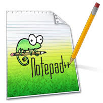
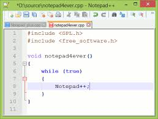
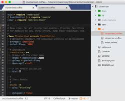

## Tools: werken met tekst-editors

Om te programmeren (zeker in C of Python) heb je een (goede) tekst-editor nodig.  
Zo'n tekst-editor laat je toe een programma te schrijven en dit op te slagen als een tekst-file.  
Dit in tegenstelling tot tekstverwerkings-programma's zoals Word, LibreOffice, Pages die gemaakt zijn om documenten op te stellen (en te formatteren).  

### Windows

Als je met Windows werkt kan je notepad gebruiken dat standaard geisntalleerd staat onder "administrative tools", maar er zijn betere keuzes zoals:

* Notepad++
* PSpad Editor
* Atom
* ...

Deze editors hebben (in tegenstelling tot notepad) eigenschappen zoals:

* *Text coloring:*  
  Bepaalde elementen (variabelen, loops, functies, ...) worden in een andere kleur geplaatst om de leesbaarheid te verhogen.  
* *Code completion:*  
  De editor kan intelligent zijn door bijvoorbeeld code die gedeeltelijk is ingevuld automatisch aan te vullen
* *Multitab*  
  Je kan meerdere tekst-file tegelijk opendoen
* *Teksttools*  
  Verscheidene tools die je kan gebruiken om tekstdocumenten te bewerken zoals vergelijken, doorzoeken op basis van patronen, ...
* ...

Voor de cursus raden we Notepad++ aan gezien de éénvoud en de grote extra functionaliteiten die deze tool biedt, maar je bent vrij een andere te gebruiken als je hierbij beter voelt (zolang deze met gewone tekst-files werkt).

Deze is volledig vrij (en gratis) beschikbaar te https://notepad-plus-plus.org.  

### Linux

Voor Linux heb je heel veel keuze:

* GEdit
* XEdit
* Scitext
* Atom
* Kate
* Leaf-pad
* ...

Elke linux-distribtrutie bevat wel 1 van deze tekst-editors, deze tools zijn allemaal vergelijkbaar op gebied van functionaliteit met elkaar.

### Mac

Een aantal populaire editors op mac zijn 

* TextMate
* TextWrangler
* Atom
* XCode
* ...

Voor de cursus stellen we het gebruik voor van TextMate die kan downloaden te https://macromates.com/  

### En verder...

Dit zijn allemaal grafische text-editors en zijn over het algemeen zeer éénvoudig om mee te werken.  
Deze hebben wel het nadeel dat je altijd tussen een command line en je editor moet wisselen, hievoor zijn er 2 alternatieven:

* Command-line editors
* IDE's, integrated development environments zoals Eclipse, Codeblocks en Visual Studio  
  (hier komen we binnen een aantal hoofdstukken nog op terug)

Voor de meer gevorderden zijn er Linux- en Mac zijn er zeer goede tekst-editors die je via de command-line bestuurt:

* Vim
* emacs
* nano
* ed
* ...

Deze zijn zeer krachtige editors die wel een zekere leercurve hebben (dus als je die voor de eerste maal probeert moet je wel wat tijd vrijmaken)

> **Windows:**  
> Deze command-line-editors zijn ook beschikbaar in Windows via Cygwin of Mingw (later meer hierover)

